# Fundamentos matemáticos en teoría de redes

::: {.callout-tip icon="false"}
## Contenidos

**Matemáticas de redes**

1.  Matriz de adyacencia y aplicaciones
2.  Matriz de incidencia y redes bipartitas
3.  Redes multicapas
4.  Grado
5.  Paseos y caminos

**Medidas y métricas**

1.  Centralidad de grado
2.  Centralidad de autovalor
3.  Centralidad de cercanía
4.  Centralidad de intermediación
5.  Transitividad y coef. de clusterización
6.  Balance estructural
:::

# Matemáticas de redes

## Matriz de adyacencia y aplicaciones

-   Notación:
    -   $n$ : número de **nodos** en una red
    -   $m$ : número de **enlaces** en una red
-   Gran parte de las redes de interés:
    -   tienen como máximo 1 enlace por par de nodos. En caso que haya más de un enlace entre par de nodos, llamamos a esos enlaces multi-lazos (***multi-edge***).
    -   no tienen lazos que conecten nodos a ellos mismos. En caso que sí lo haya, lo llamamos ***self-loops***.
    -   un grafo sin *multi-edges* ni *self-loops* es llamado ***grafo simple***.

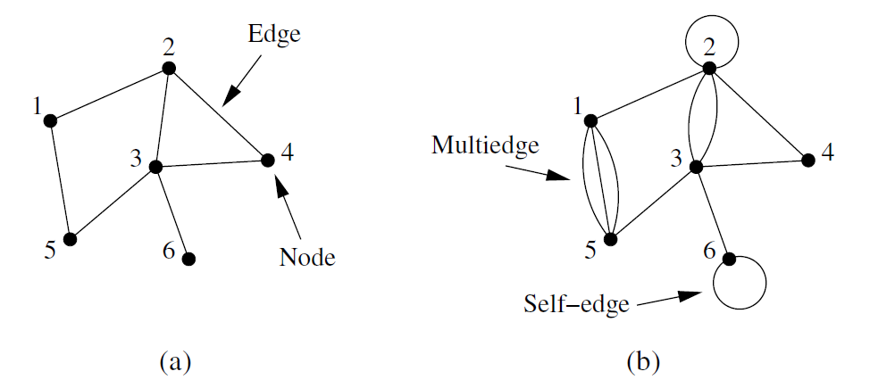{width="65%" fig-align="center"}

### Red no dirigida

-   Matriz de adyacencia:
    -   Representación fundamental de una red.
    -   Matriz $n \times n$ con elementos **(red no dirigida)**:

$$
A_{ij} = \begin{cases} 1 & \text{if there is an edge between nodes } i \text{ and } j, \\ 0 & \text{otherwise.} \end{cases}
$$

::: {layout="[55,45]"}
$$
\mathbf{A} = \begin{pmatrix}
0 & 1 & 0 & 0 & 1 & 0 \\
1 & 0 & 1 & 1 & 0 & 0 \\
0 & 1 & 0 & 1 & 1 & 1 \\
0 & 1 & 1 & 0 & 0 & 0 \\
1 & 0 & 1 & 0 & 0 & 0 \\
0 & 0 & 1 & 0 & 0 & 0
\end{pmatrix}
$$

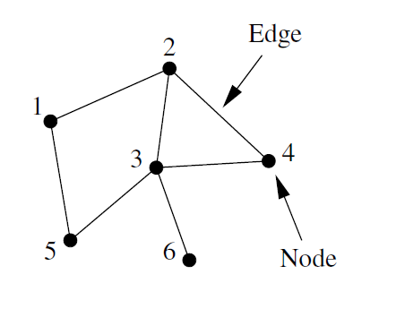
:::

-   Para redes con doble lazo entre $i$ y $j$: $A_{ij} = A_{ji} = 2$
-   Para redes con *self-loop*: $A_{ii} = 2$

### Red no dirigida ponderada

-   Matriz $n \times n$ con elementos **(red no dirigida ponderada)** (*weighted network*):

$$
A_{ij} = \alpha \in \mathbb{R}
$$

$$
\mathbf{A} = \begin{pmatrix}
0 & 0 & 2 & 0 & 1 \\
0 & 0 & 0 & 0.3 & 0 \\
2 & 0 & 0 & 0 & 0.5 \\
0 & 0.3 & 0 & 0 & 0 \\
1 & 0 & 0.5 & 0 & 0
\end{pmatrix}
$$

-   Generalmente los pesos son positivos, pero no hay ninguna razón por la que no puedan ser negativos. En una red social un peso positivo puede ser **amistad**, mientras que un peso negativo puede ser **animosidad**.

### Red dirigida

-   Matriz $n \times n$ con elementos **(red dirigida)**:

$$
A_{ij} = \begin{cases} 1 & \text{if there is an edge from } j \text{ to } i \\ 0 & \text{otherwise} \end{cases}
$$

::: {layout="[55,45]"}
$$
\mathbf{A} = \begin{pmatrix}
0 & 0 & 0 & 1 & 0 & 0 \\
0 & 0 & 1 & 0 & 0 & 0 \\
1 & 0 & 0 & 0 & 1 & 0 \\
0 & 0 & 0 & 0 & 0 & 1 \\
0 & 0 & 0 & 1 & 0 & 1 \\
0 & 1 & 0 & 0 & 0 & 0
\end{pmatrix}
$$

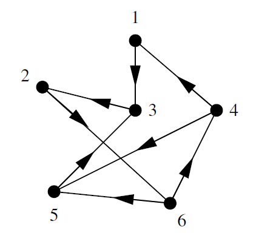
:::

-   Por lo general son **asimétricas**.
-   Para *self-loops* ahora: $A_{ii} = 1$

### Red dirigida acíclica

-   Matriz $n \times n$ con elementos **(red dirigida acíclica)**:

::: {layout="[60,40]"}
$$
\mathbf{A} = \begin{pmatrix}
0 & 0 & 1 & 0 & 1 & 0 & 0 & 0 & 0 \\
0 & 0 & 1 & 0 & 0 & 1 & 0 & 0 & 0 \\
0 & 0 & 0 & 0 & 0 & 1 & 0 & 0 & 0 \\
0 & 0 & 0 & 0 & 1 & 0 & 0 & 1 & 0 \\
0 & 0 & 0 & 0 & 0 & 0 & 1 & 0 & 1 \\
0 & 0 & 0 & 0 & 0 & 0 & 1 & 0 & 0 \\
0 & 0 & 0 & 0 & 0 & 0 & 0 & 1 & 1 \\
0 & 0 & 0 & 0 & 0 & 0 & 0 & 0 & 0 \\
0 & 0 & 0 & 0 & 0 & 0 & 0 & 0 & 0
\end{pmatrix}
$$

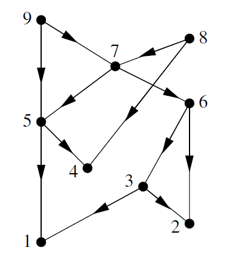
:::

-   Una red acíclica se puede escribir como una matriz **triangular superior**, y se puede dibujar manteniendo todos los lazos apuntando hacia **abajo**.

## Matriz de incidencia y redes bipartitas

-   Hay dos tipos de nodos, y lazos que solo van entre nodos de distinto tipo.
-   También llamadas **redes filiativas** en literatura sociológica.
-   Las personas están representadas por un conjunto de nodos, y los grupos por otros nodos. Los lazos identifican los grupos a los que pertenecen las personas.
-   Redes actores-películas, lectores-libros, autores-paper, etc.

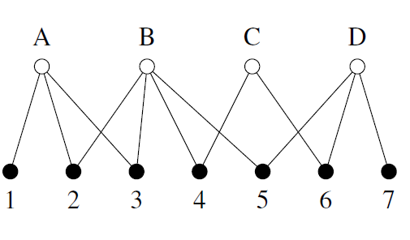{width="55%" fig-align="center"}

### Matriz de incidencia

-   Notación:
    -   $n$ : número de **nodos** en una red
    -   $g$ : número de **grupos**
-   El equivalente a la matriz de adyacencia para red bipartita (no dirigida, no ponderada) es llamada **matriz de incidencia**, que es una matriz $g \times n$ tal que:

$$
B_{ij} = \begin{cases} 1 & \text{if item } j \text{ belongs to group } i \\ 0 & \text{otherwise} \end{cases}
$$

::: {layout="[45,55]"}
$$
\mathbf{B} = \begin{pmatrix}
1 & 0 & 0 & 1 & 0 \\
1 & 1 & 1 & 1 & 0 \\
0 & 1 & 1 & 0 & 1 \\
0 & 0 & 1 & 1 & 1
\end{pmatrix}
$$

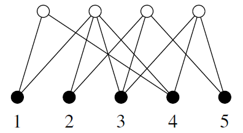
:::

### Proyecciones a un modo

Preguntas:

-   ¿Cómo obtengo los nodos que comparten al menos un grupo?
-   ¿Cómo sé cuántos comparten?
-   ¿Qué grupos tienen al menos un miembro en común?
-   ¿Cuántos comparten?

::: {layout="[55,45]"}
::: {#proj-items}
-   El número total de grupos a los que pertenecen tanto $i$ como $j$:

$$
P_{ij} = \sum_{k=1}^{g} B_{ki} B_{kj} = \sum_{k=1}^{g} B^{T}_{ik} B_{kj}
$$

$$
\mathbf{P} = \mathbf{B}^{T}\mathbf{B} \quad \ldots \text{ con traza 0 !}
$$

> Matriz cuadrada $n \times n$ — ***one mode projection***

-   El número de grupos a los que pertenece el nodo $i$:

$$
P_{ii} = \sum_{k=1}^{g} B_{ki}^{2} = \sum_{k=1}^{g} B_{ki}
$$
:::

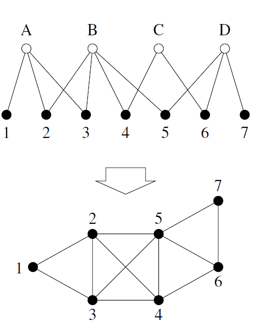
:::

::: {layout="[55,45]"}
::: {#proj-groups}
-   Número de miembros en común entre los grupos $i$ y $j$:

$$
\mathbf{P}' = \mathbf{B}\mathbf{B}^{T} \quad \ldots \text{ con traza 0 !}
$$

> Matriz cuadrada $g \times g$ — ***one mode projection***

-   El número total de grupos a los que pertenecen tanto $i$ como $j$:

$$
\mathbf{P} = \mathbf{B}^{T}\mathbf{B} \quad \ldots \text{ con traza 0 !}
$$

> Matriz cuadrada $n \times n$ — ***one mode projection***
:::

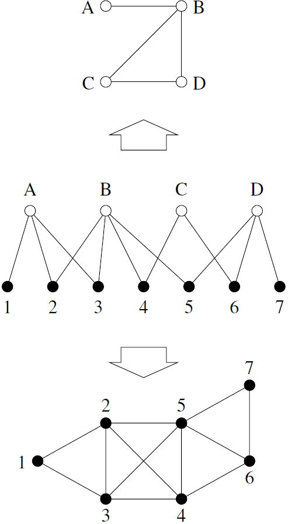
:::

## Redes multicapa

-   Una red multicapa es un conjunto de redes individuales, cada una representando nodos de un tipo particular y sus lazos; más sus *entre*-lazos entre las distintas redes.

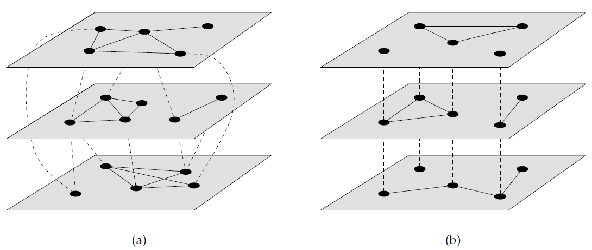{width="75%" fig-align="center"}

-   Las redes ***multiplex*** es un caso especial de redes *multilayer* en donde los nodos representan el mismo conjunto de objetos o personas en **cada red**.
-   Un ejemplo arquetípico es una red social, donde cada capa representa una esfera social distinta de **las mismas personas**, o una red de transporte, **mismos lugares**.

### Redes temporales

::: {layout="[60,40]"}
::: {#temporal}
-   Un caso especial son las *redes temporales*, cuyas estructuras de red cambian a lo largo del tiempo (ej: WWW, redes sociales, redes ecológicas).
-   En la mayoría de los casos solo los lazos cambian, por lo que tenemos redes ***multiplex***.
-   Matemáticamente:

$$
\mathbf{A}^{\alpha}, \text{ one for each layer } \alpha
$$

$$
n_\alpha \times n_\alpha
$$

$$
A^{\alpha}_{ij} \quad \text{elementos representados como 'tensores' (matrices)}
$$

$$
\mathbf{B}^{\alpha\beta}, \qquad n_\alpha \times n_\beta, \qquad B^{\alpha\beta}_{ij}
$$
:::

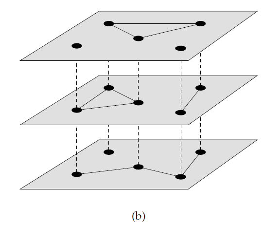
:::

## Grado

-   El *grado* de un nodo en una red no dirigida es el número de lazos con conectan con él.

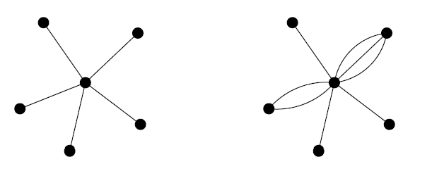{width="50%" fig-align="center"}

-   En términos de la matriz de adyacencia:

$$
k_i = \sum_{j=1}^{n} A_{ij}
$$

-   En una red no dirigida, cada lazo tiene **dos extremos**, por lo que, si hay $m$ lazos, entonces habrán $2m$ extremos de lazos. El total de extremos de lazos debe ser igual a la suma de todos los grados:

$$
2m = \sum_{i=1}^{n} k_i = \sum_{ij} A_{ij},
$$

### Grado y densidad

-   Definimos al **grado medio** de la red como $c$

$$
c = \frac{1}{n}\sum_{i=1}^{n} k_i
$$

$$
c = \frac{2m}{n}
$$

-   La cantidad máxima de lazos en una *red simple*

$$
\binom{n}{2} = \frac{1}{2} n(n-1).
$$

-   La **densidad** es la tasa de lazos que están en la red

$$
\rho = \frac{m}{\binom{n}{2}} = \frac{2m}{n(n-1)} = \frac{c}{n-1} \;\rightarrow\; \rho = \frac{c}{n}
$$

-   Se dice que la red es **densa** cuando, al aumentar $n$, la densidad no se va a cero

$$
\rho \;\xrightarrow{N \to \infty}\; \epsilon > 0
$$

-   Se dice que la red es **dispersa** cuando, al aumentar $n$, la densidad sí se va a cero

$$
\rho \;\xrightarrow{N \to \infty}\; 0
$$

-   Sin embargo, en redes reales es difícil testear esto. Coloquialmente, se dice que una red es **dispersa** simplemente cuando

$$
\rho \ll 1
$$

### Grado en redes dirigidas

-   Para **redes dirigidas** hay que definir

$$
k_i^{\text{in}} = \sum_{j=1}^{n} A_{ij} \qquad k_j^{\text{out}} = \sum_{i=1}^{n} A_{ij}.
$$

-   En este caso solo hay un extremo (== final) por cada enlace, por lo que la suma de los grados será igual a la cantidad de lazos $m$

$$
m = \sum_{i=1}^{n} k_i^{\text{in}} = \sum_{j=1}^{n} k_j^{\text{out}} = \sum_{ij} A_{ij}.
$$

-   Y, como cada lazo que sale tiene que llegar a alguna parte

$$
c_{\text{in}} = \frac{1}{n}\sum_{i=1}^{n} k_i^{\text{in}} = c_{\text{out}} = \frac{1}{n}\sum_{j=1}^{n} k_j^{\text{out}} = c = \frac{m}{n}
$$

## Paseos (*Walks*) y Caminos (*Paths*)

-   Un **paseo** es cualquier secuencia de nodos tal que cada para de nodos consecutivos están unidos por un lazo.
-   El **largo de un paseo** es la cantidad de lazos por los que pasa.
-   Un paseo que no se interseca consigo mismo es llamado **camino (*paths*)**.
-   Considera una matriz de adyacencia $A_{ij}$:
    -   El producto $A_{ik}A_{kj}$ es 1 solo si hay un paseo de longitud 2 de $i$ a $j$, **pasando por** $k$.
    -   ¿Cuántos paseos de longitud 2 hay en total entre los nodos $i$ y $j$?

$$
N^{(2)}_{ij} = \sum_{k=1}^{n} A_{ik}A_{kj} = \left[\mathbf{A}^2\right]_{ij}
$$

-   ¿Cuántos paseos de longitud $r$ hay entre los nodos $i$ y $j$?

$$
N^{(r)}_{ij} = \left[\mathbf{A}^r\right]_{ij}
$$

### Geodésicas

-   El camino más corto entre los nodos $i$ y $j$ es llamada **geodésica**, y es simplemente un problema de minimización de $r$ tal que

$$
\left[\mathbf{A}^r\right]_{ij} > 0
$$

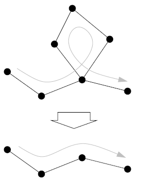{width="30%" fig-align="center"}

-   El **diámetro** de una red es la longitud de la **geodésica más larga**.

# Medidas y métricas

## Centralidad de grado

-   Centralidad: ¿cuál es el nodo más importante?
-   La más básica: centralidad de grado

$$
k_i = \sum_{j=1}^{n} A_{ij}
$$

-   Aunque básica, puede ser muy informativa en redes de amistad o en **citación de papers**.

{width="50%" fig-align="center"}

## Centralidad de autovector

-   Tu puedes tener solo 1 amigo en el mundo, pero si ese amigo es el presidente de EEUU, entonces tú debes ser alguien importante.
-   En vez de premiar con '1 punto' por cada vecino que tiene un nodo, la centralidad de **autovector** premia con un número de puntos **proporcional al puntaje de centralidad** de cada vecino.
-   Sea $x_i$ el valor numérico de la centralidad del nodo $i$, definido como

$$
x_i = \kappa^{-1} \sum_{\substack{\text{nodes } j \text{ that are} \\ \text{neighbors of } i}} x_j
$$

$$
x_i = \kappa^{-1} \sum_{j=1}^{n} A_{ij} x_j.
$$

$$
\mathbf{x} = \kappa^{-1}\mathbf{A}\mathbf{x}
$$

$$
\mathbf{A}\mathbf{x} = \kappa\mathbf{x}
$$

-   Una ecuación de autovalores puede tener varios autovectores y autovalores, pero $\mathbf{x}$ debe ser el autovector correspondiente al autovalor positivo más grande. Por lo tanto $\kappa$ debe ser aquel autovalor más grande.

$$
x_i = \kappa^{-1} \sum_{j} A_{ij} x_j
$$

-   Para **redes dirigidas** podemos encontrarnos con un problema grave:

::: {layout="[35,65]"}
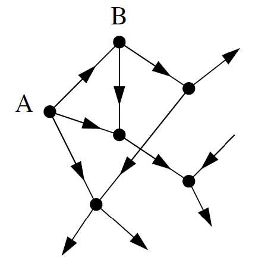

::: {#autovector-problema}
-   El nodo A solo tiene lazos *outgoing*. Entonces la debería tener centralidad 0.
-   El nodo B solo tiene 1 lazo *ingoing*. Pero ese lazo es A. Tiene centralidad 0.
-   Entonces, ¿todos los demás nodos tienen centralidad 0?
-   La solución es agregar 'un poco de centralidad', creando lo que se llama **centralidad de Katz:**

$$
x_i = \alpha \sum_{j} A_{ij} x_j + \beta,
$$

-   Supongamos ahora que hay un nodo con centralidad muy alta, que apunta a un millón de otros nodos. ¿Deberían esos nodos tener también una centralidad muy alta? **Centralidad PageRank**

$$
x_i = \alpha \sum_{j} A_{ij} \frac{x_j}{k_j^{\text{out}}} + \beta
$$
:::
:::

## Centralidad de cercanía

-   Medida que calcula la distancia media de un nodo al resto de nodos.
-   Distancia == geodésica == $d_{ij}$
-   Entonces la distancia media:

$$
\ell_i = \frac{1}{n} \sum_{j} d_{ij}
$$

-   Para que la centralidad sea mayor para los que tienen menor distancia:

$$
C_i = \frac{1}{\ell_i} = \frac{n}{\sum_j d_{ij}}
$$

-   Usando datos de películas, la centralidad de cercanía más alta es de 0.4143 para el actor Christopher Lee. Él no fue tan famoso ni tuvo tanto éxito como algunos de sus contemporáneos. Sin embargo, apareció en un número extraordinario de películas: más de 200. Esto por sí solo tiende a reducir su distancia promedio a otros nodos en la red al aumentar el número de sus conexiones. La centralidad de **cercanía** tiene **correlación positiva** con la centralidad de **grado**.

## Centralidad de intermediación

-   Supongamos que necesito pasar con cierta urgencia una carta a un nodo del Grupo 2. De seguro esa carta recorrerá una geodésica. Ahora, gran número de las **geodésicas pasan por A**.

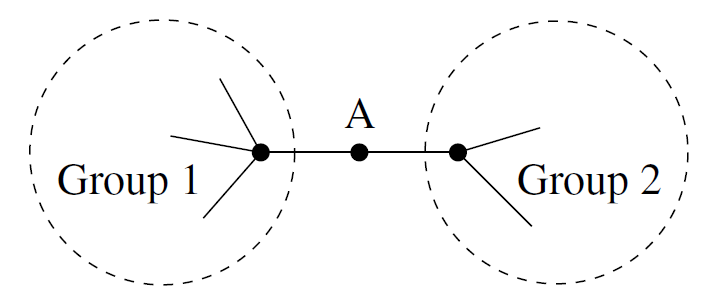{width="45%" fig-align="center"}

-   La centralidad de intermediación es una medida proporcional al número de geodésicas en las que está aquel nodo.
-   En grupos distintos, el nodo A puede obtener un montón de poder y riqueza dada su posición en la red.
-   Sea $n^{i}_{jk} = 1$ si el nodo $i$ está en la geodésica entre $j$ y $k$.

$$
x_i = \sum_{jk} n^{i}_{jk}
$$

-   Pero también hay casos donde hay **más de una geodésica** entre dos nodos.

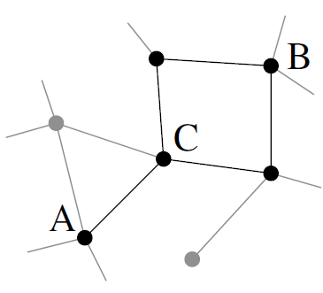{width="30%" fig-align="center"}

-   Sea $g_{jk}$ el número de geodésicas entre $j$ y $k$.

$$
x_i = \sum_{jk} \frac{n^{i}_{jk}}{g_{jk}}
$$

-   Curiosamente, no se usa mucho *betweenness* para redes dirigidas. El ejemplo de la carta **usa** las redes sociales ya construidas (no dirigidas).

## Transitividad

-   Es una noción importante particularmente en redes sociales.
-   La relación $>$ es transitiva, pues

$$
a > b \;\wedge\; b > c \;\Longrightarrow\; a > c
$$

-   También $=$, pues

$$
a = b \;\wedge\; b = c \;\Longrightarrow\; a = c
$$

-   ¿Qué pasa si lo extendemos a redes sociales?

::: {layout="[70,30]"}
$$
A_{uv} = 1 \;\wedge\; A_{vw} = 1 \;\overset{?}{\Longrightarrow}\; A_{uw} = 1
$$

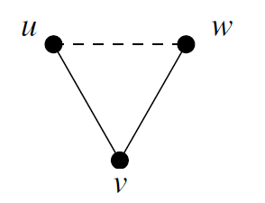
:::

-   Para cuantificar la ***transitividad*** en una red, definimos el **índice de clusterización** como la fracción de caminos (paths) de longitud 2 que están *cerrados*.

$$
C = \frac{(\text{number of closed paths of length two})}{(\text{number of paths of length two})}
$$

::: {layout="[75,25]"}
::: {#transitividad-formulas}
-   Ya que cada triángulo contiene exactamente 6 caminos de longitud 2:

$$
C = \frac{(\text{number of triangles}) \times 6}{(\text{number of paths of length two})}.
$$

-   Ojo que por cada par de caminos de longitud 2, tenemos un **triplete conectado**

$$
C = \frac{(\text{number of triangles}) \times 3}{(\text{number of connected triples})}.
$$

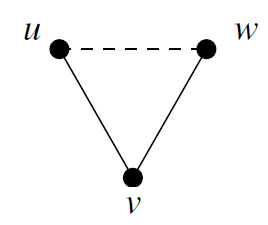{width="25%"}
:::

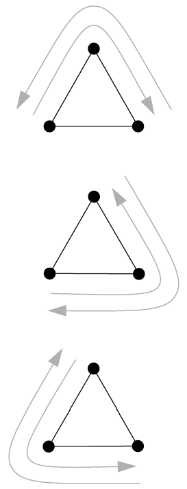
:::

### Clusterización local

-   Las redes sociales tienden a tener una mayor clusterización global ($C \approx 0.1$) que otros tipos de redes (por ejemplo redes informáticas $C \approx 0.01$).
-   También podemos definir la noción de transitividad para nodos aislados.

$$
C_i = \frac{(\text{number of pairs of neighbors of } i \text{ that are connected})}{(\text{number of pairs of neighbors of } i)}.
$$

::: {layout="[65,35]"}
::: {#clusterizacion-local}
-   La **clusterización local** presenta una correlación **negativa** con la medida de grado.
-   Cuando no encontramos la cantidad esperada de conecciones **entre** los vecinos de un nodo, decimos que hay ***structural holes***.
-   La clusterización local es una medida del poder en el flujo de info. en ese vecindario. Es como una versión local de *betweenness*.
:::

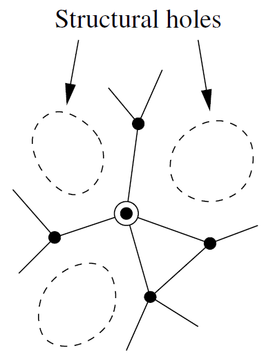
:::

## Balance estructural

-   Para redes ponderadas, $A_{ij} = \alpha \in \mathbb{R}$. Es decir, pueden tener **valores negativos**.
-   'El amigo de mi amigo es mi amigo': $\;+ * + = +$
-   'El amigo de mi enemigo es mi enemigo': $\;+ * - = -$
-   'El enemigo de mi enemigo es mi amigo': $\;- * - = +$
-   Aquellos con un número **par** de '$-$', se dice **balanceada** al ser más estable.
-   Esta regla se mantiene para configuraciones de *loops* más grandes.
-   Para redes no ponderadas, las triadas balanceadas son aquellas con un número par de lazos, es decir, 0 lazos o 2 lazos.

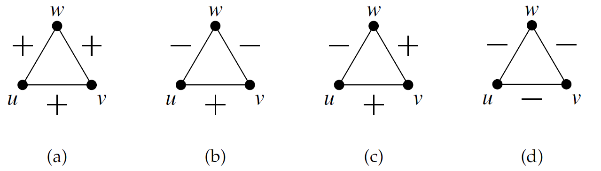{width="80%" fig-align="center"}
