# Mecanismos de Formación

::: {.callout-tip icon="false"}
## Contenidos

1.  Redes aleatorias
    1.  Número de enlaces
    2.  Grado medio
    3.  Distribución de grado
    4.  Coeficiente de clusterización
    5.  Componente principal
2.  Redes de mundo pequeño
    1.  Propiedad de mundo pequeño
    2.  Modelo Watts-Strogatz
3.  Redes libres de escala
    1.  Propiedad libre de escala
    2.  Significado libre de escala
    3.  Propiedad mundo pequeño
    4.  Modelo Albert-Barábasi
:::

# Redes aleatorias

## Definición

-   Nomenclatura:

> Redes aleatorias == Erdös–Rényi model == Gilbert model

-   Definiciones:
    -   $G(N, L)$ Model — $N$ nodos y $L$ enlaces, *ala* Erdös–Rényi
    -   **$G(N, p)$ Model** — $N$ nodos y $p$ probabilidad de enlace, *ala* Gilbert *(el que usaremos)*
-   Definición:

> A random network consists of $N$ nodes where each node pair is connected with probability $p$.

1)  Comienza con $N$ nodos aislados.
2)  Selecciona un par de nodos y genera un número aleatorio entre $0$ y $1$. Si el número excede $p$, conecta el par de nodos seleccionado con un enlace; de lo contrario, déjalos desconectados.
3)  Repite el paso (2) para cada uno de los $N(N-1)/2$ pares de nodos.

-   Erdös papers:

::: {layout="[50,50]"}
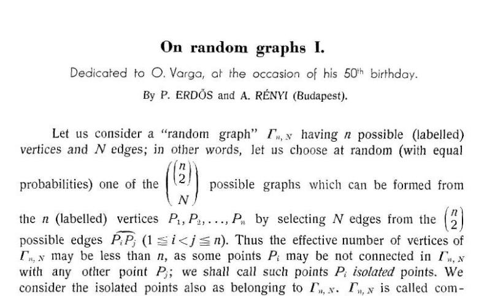

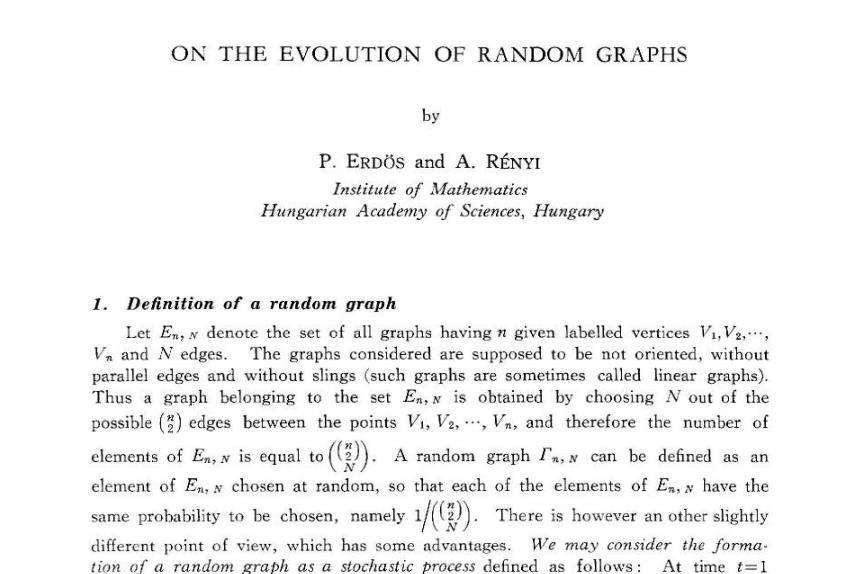
:::

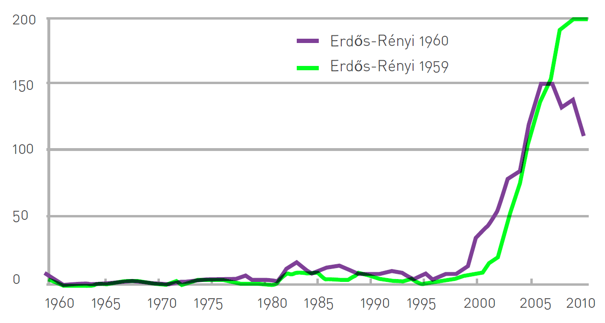{width="60%" fig-align="center"}

## Número de enlaces

-   Si una red tienen $N$ nodos, entonces existen $N(N-1)/2$ pares de nodos.
-   Probabilidad que obtener $x$ sellos al tirar $N$ veces una moneda:

$$
p_x = \underbrace{\binom{N}{x}}_{\substack{\text{Número de maneras} \\ \text{distintas de tener } x \text{ éxitos} \\ \text{en } N \text{ lanzamientos}}}
\;\underbrace{p^{x}}_{\substack{\text{Probabilidad que } x \\ \text{lanzamientos hayan} \\ \text{sido sello}}}
\;\underbrace{(1-p)^{N-x}}_{\substack{\text{Probabilidad que } N \\ \text{lanzamientos hayan} \\ \text{sido cara}}}
$$

-   Probabilidad que una realización tenga exactamente $L$ enlaces:

$$
p_L = \underbrace{\binom{\frac{N(N-1)}{2}}{L}}_{\substack{\text{Número de formas de} \\ \text{colocar } L \text{ enlaces} \\ \text{entre } N(N-1)/2 \text{ pares}}}
\;\underbrace{p^{L}}_{\substack{\text{Probabilidad que } L \\ \text{intentos hayan} \\ \text{resultado en enlaces}}}
\;\underbrace{(1-p)^{\frac{N(N-1)}{2}-L}}_{\substack{\text{Probabilidad que los} \\ \text{restantes } N(N-1)/2 - L \\ \text{pares no hayan} \\ \text{terminado con enlace}}}
$$

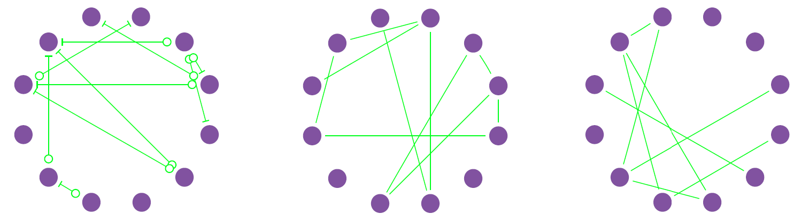{width="70%" fig-align="center"}

## Grado medio

-   Por lo que el **número de enlaces** esperados en red aleatoria:

$$
\langle L \rangle = \sum_{L=0}^{N} L\, p_L = p\,\frac{N(N-1)}{2}
$$

-   Y el **grado medio** en red aleatoria:

$$
\langle k \rangle = \frac{2\langle L \rangle}{N} = p(N-1)
$$

> Que es equivalente al número de enlaces esperado para 1 solo nodo.

## Distribución de grado

-   En una red aleatoria, la probabilidad que un nodo $i$ tenga exactamente $k$ vecinos:

$$
p_k = \underbrace{\binom{N-1}{k}}_{\substack{\text{Número de formas de} \\ \text{tener } k \text{ enlaces entre} \\ N-1 \text{ nodos}}}
\;\underbrace{p^{k}}_{\substack{\text{Probabilidad de tener} \\ k \text{ enlaces presentes} \\ \text{en esa realización}}}
\;\underbrace{(1-p)^{N-1-k}}_{\substack{\text{Probabilidad que los} \\ \text{restantes } N-1-k \text{ nodos no} \\ \text{presenten enlace}}}
$$

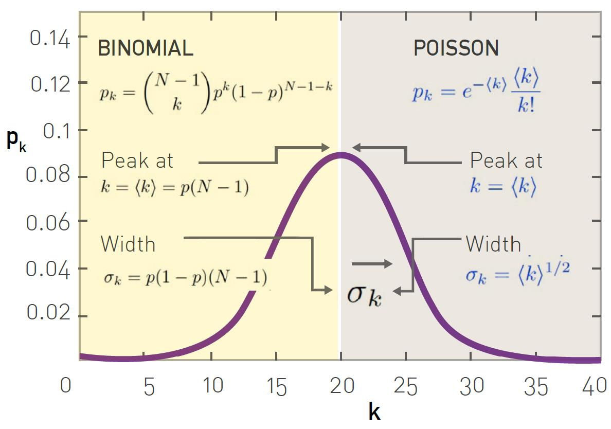{width="65%" fig-align="center"}

-   Ahora bien, la mayoría de las redes son dispersas: $\langle k \rangle \ll N$

$$
p_k = \binom{N-1}{k} p^{k} (1-p)^{N-1-k} \quad\longrightarrow\quad p_k = e^{-\langle k \rangle}\,\frac{\langle k \rangle^{k}}{k!}
$$

-   No depende de $N$, por lo que es agnóstica del tamaño.
-   Depende de un solo parámetro, $\langle k \rangle$.
-   Las redes sociales reales **no son aleatorias**.

$$
\langle k \rangle \approx 1{,}000 \;\rightarrow\; \sigma_k = 31.62
$$

-   O sea que las personas tienen entre 968 y 1032 conocidos, pero está documentado que Franklin Delano Roosevelt (US President) tenía \~22000 conocidos.
-   De hecho, no solo las redes sociales **no son aleatorias**:

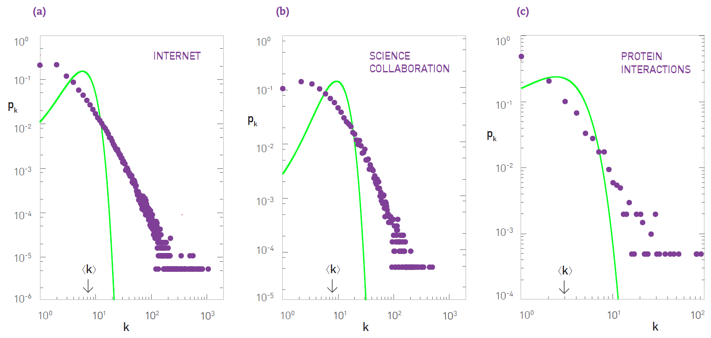{width="85%" fig-align="center"}

## Coeficiente de clusterización

-   Recordemos que la clusterización local se definía como:

$$
C_i = \frac{(\text{number of pairs of neighbors of } i \text{ that are connected})}{(\text{number of pairs of neighbors of } i)}.
$$

-   Ahora, notemos que

$$
\langle L_i \rangle \;\rightarrow\; \substack{\text{Número esperado de} \\ \text{links entre los } k \\ \text{vecinos de un nodo } i}
\qquad\qquad
\frac{1}{2}k_i(k_i - 1) \;\rightarrow\; \substack{\text{Número de posibles} \\ \text{links entre los } k \\ \text{vecinos del nodo } i}
$$

-   Pero en una aleatoria simplemente se creará una fracción de los posibles

$$
\langle L_i \rangle = p\,\frac{k_i(k_i-1)}{2}
$$

-   Entonces

$$
C_i = \frac{\langle L_i \rangle}{\frac{1}{2}k_i(k_i-1)} = p = \frac{\langle k \rangle}{N}.
$$

-   Notemos que:
    -   Para redes aleatorias, la clusterización **global** debe ser igual a la **local**.
    -   Si las redes fueras aleatorias, la clusterización debería decrecer según $1/N$.
    -   La clusterización **no depende de** $k$, sino que del término global $\langle k \rangle$.
-   Comparemos con redes reales:

::: {layout="[20,80]"}
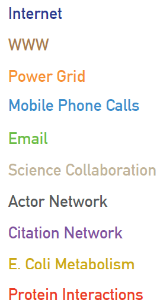

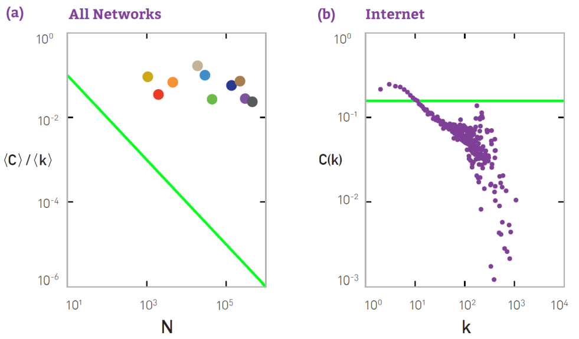
:::

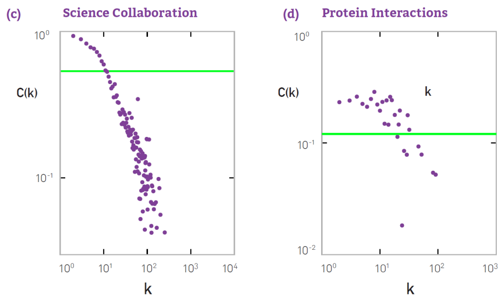{width="80%" fig-align="center"}

## Componente principal

-   En 1959, Erdös descubrió que la emergencia de una componente principal no es suave.

{width="90%" fig-align="center"}

-   Cuando $\langle k \rangle > 1$ **se reconoce una red**.
-   Cuando $\langle k \rangle \gg \ln N$, **se espera solo 1 componente**.

| NETWORK               |       $N$ |        $L$ | $\langle k \rangle$ | $\ln N$ |
|-----------------------|----------:|-----------:|--------------------:|--------:|
| Internet              |   192,244 |    609,066 |                6.34 |   12.17 |
| Power Grid            |     4,941 |      6,594 |                2.67 |    8.51 |
| Science Collaboration |    23,133 |     94,439 |                8.08 |   10.05 |
| Actor Network         |   702,388 | 29,397,908 |               83.71 |   13.46 |
| Protein Interactions  |     2,018 |      2,930 |                2.90 |    7.61 |

: Redes reales: en todas $\langle k \rangle > 1$, pero ninguna alcanza $\langle k \rangle \gg \ln N$. {#tbl-redes-reales}

# Redes de Mundo Pequeño

## Propiedad de mundo pequeño

-   Milgram: Seis grados de separación -\> longitud de camino corta -\> ¿comparado con qué?
-   En una red aleatoria, ¿cuántas personas están a una distancia $d$?
    -   $\langle k \rangle$ nodos a distancia uno ($d = 1$).
    -   $\langle k \rangle^2$ nodos a distancia dos ($d = 2$).
    -   $\langle k \rangle^3$ nodos a distancia tres ($d = 3$)…
    -   … $\langle k \rangle^d$ nodos a distancia $d$.
-   Por lo tanto, el número **total** de nodos que están como máximo a distancia $d$

$$
N(d) \approx 1 + \langle k \rangle + \langle k \rangle^2 + \ldots + \langle k \rangle^d = \frac{\langle k \rangle^{d+1} - 1}{\langle k \rangle - 1}
$$

$$
\rightarrow \langle k \rangle^{d_{\max}} \approx N. \qquad\qquad \rightarrow d_{\max} \approx \frac{\ln N}{\ln \langle k \rangle} \quad \text{(diámetro de red aleatoria)}
$$

> $\langle d \rangle \sim \ln N$ — **propiedad mundo pequeño**

-   Comparemos el diámetro esperado en **redes aleatorias** vs **redes regulares**

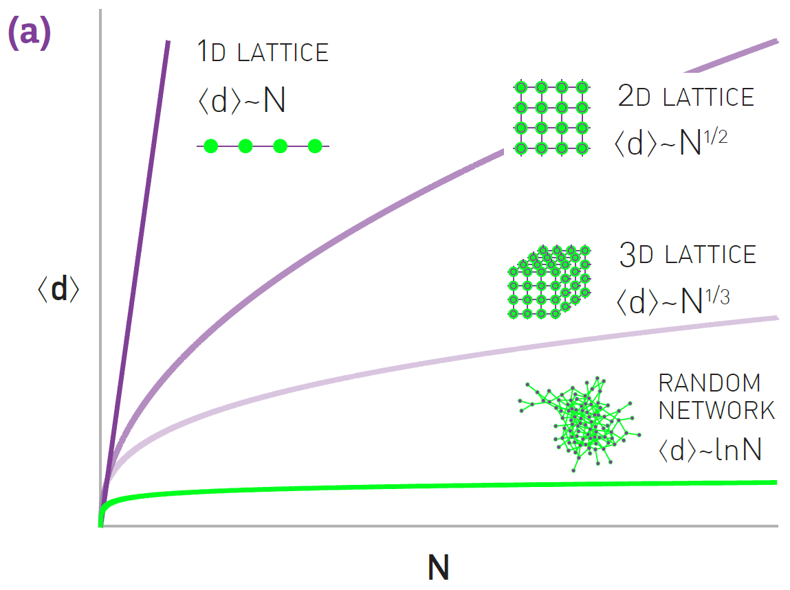{width="60%" fig-align="center"}

-   En general, para una red regular $d$-dimensional

$$
\langle d \rangle \sim N^{1/d}
$$

## Modelo Watts-Strogatz

::: {layout="[55,45]"}
::: {#ws-texto}
-   Animados por:
    -   Coeficiente de clusterización alto para redes reales según varía $N$.
    -   Diámetro con crecimiento logarítmico con respecto a $N$.
-   Notaron que:
    -   Redes regulares: alta clusterización, baja propiedad mundo pequeño
    -   Redes aleatorias: baja clusterización, alta propiedad mundo pequeño
-   Sin embargo adolece de:
    -   Distribución de grado Poisson similar a red aleatoria → no hubs
    -   Clusterización similar a red regular → no dependencia en $k$.
:::

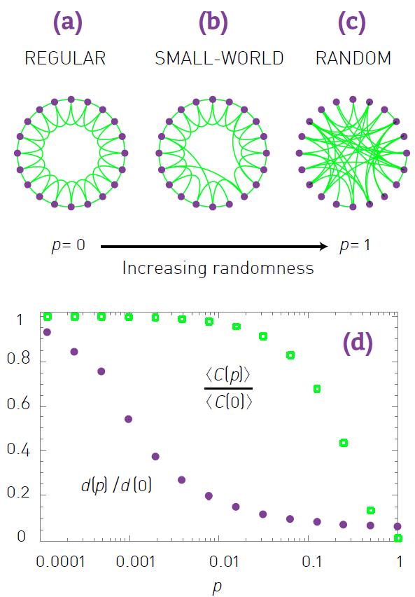
:::

# Redes Libres de Escala

## Propiedad libre de escala

-   Al ver la distribución de grado de la red WWW en un plot log-log, vemos que quedaría bien descrita por

$$
\log p_k \sim -\gamma \log k \quad\longrightarrow\quad p_k \sim k^{-\gamma}
$$

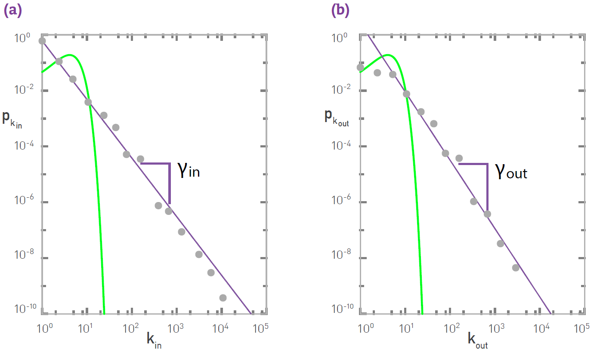{width="75%" fig-align="center"}

-   La red aleatoria
    -   Sub-estima la cantidad de nodos con *low-degree*.
    -   Sobre-estima la cantidad de nodos con $k \sim \langle k \rangle$.
    -   Sub-estima el número de nodos con *high-degree* (hubs).
-   El hecho que la *recta* no dependa del $N$ de la red, hace que se llame *libre de escala*.

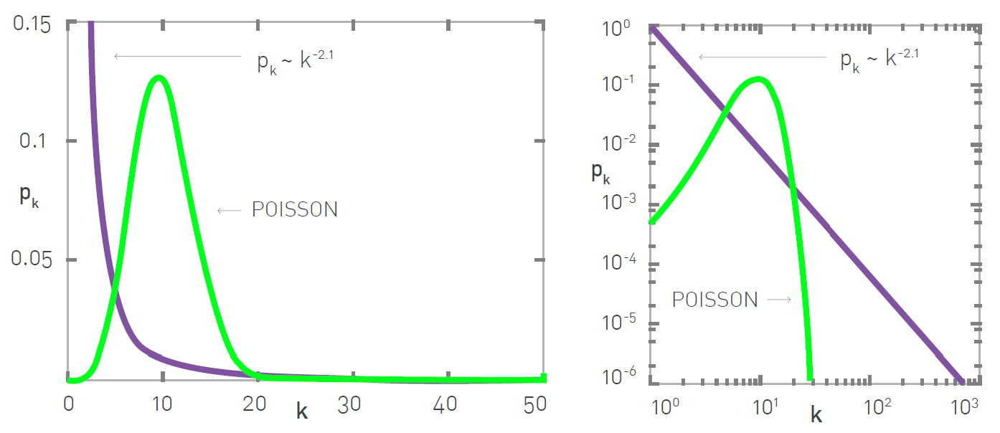{width="75%" fig-align="center"}

## Significado de libre de escala

::: {layout="[65,35]"}
::: {#momentos}
-   Para una red con distribución *power-law*, su $n$-ésimo momento:

$$
\langle k^n \rangle = \int_{k_{\min}}^{k_{\max}} k^n p(k)\,dk = C\,\frac{k_{\max}^{\,n-\gamma+1} - k_{\min}^{\,n-\gamma+1}}{n-\gamma+1}
$$

-   Queremos ver el comportamiento para $k_{\max} \to \infty$
    -   Todos los momentos con $n < \gamma - 1$ son finitos.
    -   Todos los momentos con $n > \gamma - 1$ son infinitos.
-   La desviación estándar corresponde al momento $n = 2$.
-   Típicamente, estas redes tienen $2 < \gamma < 3$.
-   Por lo tanto, el grado de un nodo seleccionado aleatoriamente

$$
k = \langle k \rangle \pm \sigma_k \in [\,{}^{-}\infty, {}^{+}\infty\,]
$$
:::

::: {#momentos-recordatorio}
$$
\langle x \rangle = \sum_{x=0}^{N} x\,p_x
$$

$$
\langle x^2 \rangle = \sum_{x=0}^{N} x^2\,p_x
$$

$$
\sigma_x = \sqrt{\langle x^2 \rangle - \langle x \rangle^2}
$$
:::
:::

{width="55%" fig-align="center"}

## Modelo Albert-Barábasi

-   Nomenclatura:

> Modelo Albert-Barábasi == Modelo BA == Modelo *scale-free*

-   Es un *mecanismo de formación* que sigue un *preferential-attachment*. Antigua idea del fenómeno *rich-gets-richer*.
-   Modelo:
    -   Comenzamos con $q$ nodos y $q$ enlaces.
    -   En cada paso un nuevo nodo se conecta a otros $m$ nodos ya existentes, siguiendo *preferential-attachment*:

$$
\Pi(k_i) = \frac{k_i}{\sum_j k_j}
$$

-   Después de $t$ pasos, tenemos un total de nodos $N = q + t$, y un total de enlaces $q + mt$.

### Crecimiento de una red Barabási–Albert

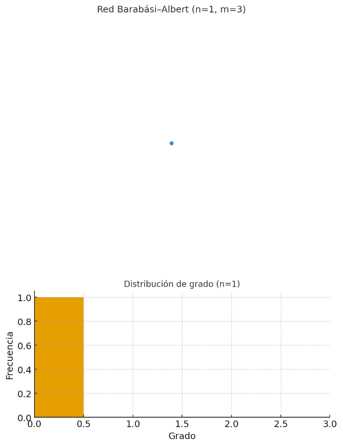{width="55%" fig-align="center"}
