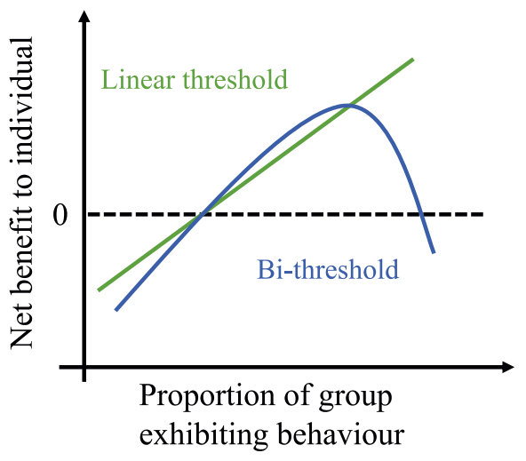
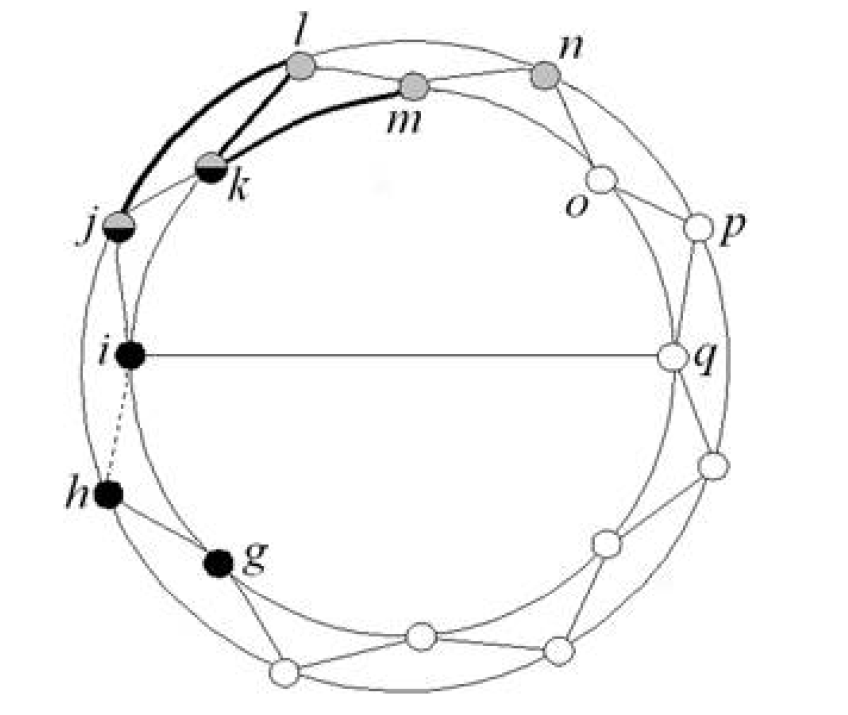
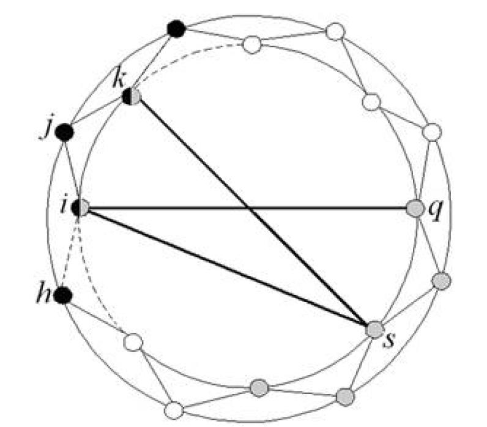

# Contagio social en redes

::: {.callout-tip icon="false"}
## Qué haremos

**¿Y si una exposición no basta?** Cuando adoptar es costoso —porque hay que coordinarse, porque no es creíble, porque puede ser mal visto, o porque se necesita el ánimo de otros— se necesitan **varias** fuentes que refuercen.

La frase-guía del bloque: *para un contagio simple, que la semilla vea lejos; para uno complejo, que la semilla vea acompañada.*
:::

| Sección | Contenido |
|---|---|
| 1. Umbrales | Granovetter (1978) → Valente (1996); qué es un contagio complejo |
| 2. Mecanismos | Por qué una exposición no basta: coordinación, credibilidad, legitimidad, emoción |
| 3. Características | Fracciones, fuentes independientes, similitud vs. diversidad, bi-umbral, sesgos |
| 4. Lazos largos | Centola & Macy (2007): puentes anchos vs. atajos |
| 5. Centralidad compleja | Guilbeault & Centola (2021), con su evidencia mixta |
| 6. netdiffuseR | De la encuesta al `diffnet`; simulaciones básicas |
| Anexo | Transiciones de fase de primer y segundo orden |

# Umbrales para la acción colectiva

## Granovetter (1978): decidir bajo interdependencia

El punto de partida de todo modelo de contagio social es una idea simple de Granovetter: muchas decisiones son **binarias** (actuar o no actuar) y su utilidad **depende de cuántos otros ya actuaron**.

Supongamos cada individuo $i$ tiene un **umbral** $\tau_i$: la fracción mínima de adoptantes que necesita observar para actuar:

$$
a_i = 1 \iff r \geq \tau_i,
$$

donde $r$ es la proporción de la población que ya actuó. Lo notable es que la **distribución de umbrales** captura *toda* la dinámica. **Agregación ≠ preferencias individuales**.

::: callout-note
## Ejemplo canónico

Hay 100 trabajadores con umbrales $0, 1, 2, \ldots, 99$. El de umbral 0 actúa; eso activa al de umbral 1; eso activa al de umbral 2… **los 100 terminan actuando**.

Ahora quitamos al trabajador de umbral 1 y lo reemplazamos por otro de umbral 2.El proceso *muere* en 1.

Dos poblaciones con preferencias casi idénticas producen resultados colectivos opuestos. El resultado de la acción colectiva no está en las preferencias, está en **su distribución**.
:::

::: callout-note
## Dos precisiones de Granovetter que se olvidan

**El umbral no es una preferencia.** Es el punto donde la *utilidad neta* de actuar se vuelve positiva. Un utilitarista puro y alguien sensible al estatus pueden tener el mismo umbral por razones distintas. 

Es "una medida conductual contingente, no una medida pura de preferencias normativas". (De hecho, el umbral se puede derivar formalmente de un juego de coordinación: Morris 2000; Easley & Kleinberg 2010, cap. 19.)
:::

## Valente (1996): el umbral se vuelve de red

En vez de ver la proporción global $r$, cada persona mira su **propia red**. La **exposición** de $i$ es la fracción de sus contactos que ya adoptaron,

$$
E_i = \frac{\sum_{j} X_{ij}\, a_j}{\sum_{j} X_{ij}},
$$

entonces:
$$
a_i = 1 \Leftrightarrow E_i \geq \tau_i
$$

Es la misma idea de Granovetter, pero ahora el resultado colectivo pasa a depender de la topología.

## Qué es un contagio complejo

Antes de seguir con la estructura, conviene detenerse a explicar *qué* es un contagio complejo y *qué lo explica*.

La definición canónica es la de Centola & Macy (2007): un contagio es **simple** cuando basta *un* contacto con una fuente activada para transmitirlo (una enfermedad, una noticia, una oferta de trabajo), y es **complejo** cuando *"requiere contacto con múltiples fuentes de activación"*.

La palabra "umbral", sin embargo, es anterior a la red: ya está en Granovetter (1978), quien lo define como *"el punto donde los beneficios netos empiezan a exceder los costos netos"* de actuar. Su Figura 3 dibuja, para un individuo con umbral del 38%, el beneficio neto de sumarse a un motín según la fracción del grupo que ya participa: mientras la curva está bajo cero, no actúa; cuando la cruza, actúa. En la versión más simple, ese beneficio neto crece **linealmente** con la adopción:

```{r}
#| label: fig-umbral-utilidad-neta
#| fig-cap: "El umbral como utilidad neta. Para un individuo con $\\tau = 0.38$ (el ejemplo de Granovetter), el beneficio neto de actuar crece con la fracción $r$ de adoptantes y se vuelve positivo exactamente en $r = \\tau$. A la izquierda del umbral no adopta; a la derecha, sí."
#| fig-height: 3.8
#| fig-width: 6
#| echo: false
tau <- 0.38
r   <- seq(0, 1, by = 0.01)
u   <- r - tau                                   # utilidad neta lineal
par(mar = c(4.5, 4.5, 1, 1))
plot(r, u, type = "n", xlab = "Fracción de adoptantes  r", ylab = "Utilidad neta de adoptar",
     ylim = c(-0.5, 0.7), xaxs = "i", las = 1)
rect(tau, -1, 1.05, 1, col = "#e6f4ea", border = NA)   # zona de adopción
abline(h = 0, col = "grey40")
lines(r, u, lwd = 3, col = "#2e8b57")
points(tau, 0, pch = 19, cex = 1.4, col = "#2e8b57")
text(tau, 0.06, expression(tau), pos = 3, cex = 1.3)
text(0.05, 0.6, "no adopta", adj = 0, col = "grey30")
text(0.97, 0.6, "adopta", adj = 1, col = "#2e8b57", font = 2)
```

Guardemos esta figura: más abajo, el **bi-umbral** será simplemente la misma curva pero no monotónica, que vuelve a cruzar el cero cuando demasiados adoptan. Granovetter mismo lo anticipó: su modelo estipula que la curva no cruce el eje "más de una vez", y advierte que si lo hace "se necesitan modelos más complejos".

::: callout-note
## Ejemplos que la literatura ha tratado como contagio complejo

- **Conductas de salud en un foro en línea** (Centola 2010, *Science*): registrarse en un sitio de salud se difundió más y más lejos en redes clusterizadas que en aleatorias.
- **Hashtags políticos y controversiales** en Twitter (Romero et al. 2011), frente a los idiomáticos, que se comportan como contagio simple.
- **Cambiar la foto de perfil por el signo igual** en apoyo al matrimonio igualitario (State & Adamic 2015).
- **Una técnica agrícola nueva** en Malawi (Beaman et al. 2021): casi nadie adopta con un vecino informado, pero sí varios con dos.
- **Salir a protestar** en la Primavera Árabe (Steinert-Threlkeld 2017) y en las protestas de 2011–2013 (Barberá et al. 2015).
- **En teoría:** la credibilidad de una leyenda urbana, la adopción de una tecnología nueva, la disposición a participar en una manifestación riesgosa, una moda de vanguardia (Centola & Macy 2007).
:::

# Mecanismos de contagio complejo


¿Por qué una exposición no basta? Cuatro mecanismos identificados, cada uno con su microfundamento. 

1. **Complementariedad estratégica**

La innovación vale más cuantos más la usan: un teléfono, una red social, una moneda. Eso es, formalmente, un **juego de coordinación**: mi pago depende de que los demás elijan lo mismo que yo. 

Morris (2000) demostró que en una red ese juego produce exactamente un umbral: me conviene cambiar cuando la fracción de vecinos que ya cambió supera $q = b/(a+b)$, donde $a$ y $b$ son los pagos de coordinar en cada opción.

2. **Credibilidad**

No sé la calidad de la innovación. Una mezcla entre **cascadas informacionales** (si tres personas que eligieron por separado adoptaron, eso actualiza mi creencia más que una sola -Bikhchandani, Hirshleifer & Welch 1992 y Banerjee (1992)-) y **efecto de fuentes múltiples** (la información que llega de fuentes que no se coordinaron entre sí es más informativa que la misma información repetida -Harkins & Petty 1981, 1987-).

3. **Legitimidad**

Aquí no dudo de si funciona, sino de si *está permitido*. Ver a *varios* cercanos asistir a una protesta es lo que la legitima (Granovetter 1978; McAdam 1986 sobre el activismo de alto riesgo).

Bicchieri (2006) define una **norma social** como una regla que sigo porque espero que los demás la sigan *y* que esperen que yo la siga; por eso necesito ver a varios cumplirla para creer que rige. Samuelson & Zeckhauser (1988) agregan el freno del **sesgo de statu quo**: ante la duda, la gente se queda donde está.

4. **Contagio emocional**

Los impulsos expresivos se amplifican en reuniones concentradas social y espacialmente.

La barrera no es cognitiva sino afectiva: necesito que sientan lo mismo. Hatfield, Cacioppo & Rapson (1993) documentan el **contagio emocional** automático: mimetismo facial, sincronía postural, convergencia afectiva.

::: callout-tip
## Resumen

*Coordinación necesita que los demás lo usen; credibilidad, que lo prueben; legitimidad, que lo aprueben; emoción, que lo sientan.* Las cuatro son cosas que una sola persona no puede darme.
:::

# Características del contagio complejo

## Se usan fracciones, no conteos

En un contagio simple, los no-adoptantes son irrelevantes: si tengo contacto con alguien con sarampión, me contagio, sin importar cuántos sanos conozca. En un contagio complejo, los no-adoptantes **son una señal activa** (*influencias contrarias*). Por lo tanto, lo que predice adopción no es cuántos amigos ya lo han hecho, sino **qué fracción**.

O sea, cuanto más conectado estás, **más influencias contrarias enfrentas**. Por eso los "hubs" suelen ser *frenos* y no *aceleradores* de los contagios complejos. Eso explica por qué los movimientos —la Primavera Árabe en Egipto (Steinert-Threlkeld 2017), el *Ice Bucket Challenge* (Sprague & House 2017)— **nacieron en la periferia**.

## Número de fuentes, no de exposiciones

Lo que cuenta no es cuántas *veces* recibo la señal, sino de cuántas **fuentes distintas e independientes** la recibo. Harkins & Petty (1981, 1987) hallaron este *efecto de fuentes múltiples*: los mismos argumentos, presentados por varias personas *independientes*, persuaden más que repetidos por una. 

## Bi-threshold: umbral de desadopción

Si el umbral es el punto donde la utilidad neta se vuelve positiva, nada impide que **demasiada** adopción la vuelva negativa de nuevo. Tres posibles mecanismos (Alipour et al. 2024):

{width="45%" fig-align="center"}

- **Saturación o congestión**: el valor cae con la multitud (bar "El Farol" de Arthur; una app que se vuelve lenta).
- **Pérdida de distinción**: el *snob effect* de Leibenstein (1950), lo que valía por exclusivo deja de valer cuando lo tiene todo el mundo.
- **Señalización de identidad**: abandonar un rasgo cuando lo adoptan los "otros" (Berger & Heath 2007).

## Similitud o diversidad: depende de la barrera

Si las fuentes independientes son lo que convence, ¿deben parecerse a mí o ser distintas entre sí? Centola (2022) responde que **depende de cuál barrera opera**:

Cuando la barrera es **credibilidad** o **emoción**, convencen los pares *similares* — la prueba social de mi propio grupo (Centola 2011: la homofilia aumenta la adopción de conductas de salud). 

Cuando la barrera es **legitimidad**, también convencen las fuentes *diversas*:  State & Adamic (2015) midieron el cambio masivo de fotos de perfil en Facebook en apoyo al matrimonio igualitario en el caso del signo igual, la gente cambió su foto cuando vio adoptantes de círculos sociales distintos — abuelos, colegas, amigos del colegio —. Eso probaba que el apoyo era amplio y el riesgo social era bajo.

## Confirmar sesgos (simple) vs desafiarlos (complejo)

La información que *confirma* los sesgos de una comunidad es fácil de entender y de aceptar (contagio **simple**), y la información que *desafía* esos sesgos encuentra resistencia (contagio **complejo**), por lo que la desinformación siempre corre con ventaja de mecanismo. 

Ejemplo: Las mascarillas en la pandemia. La misma conducta es contagio simple en comunidades que confiaban en la autoridad sanitaria y contagio complejo donde no.


# Contagio complejo y la debilidad de los lazos largos

Granovetter (1973) mostró que los lazos débiles aceleran las difusiones simples: una enfermedad, información laboral, una noticia. Dijo: *"lo que sea que se deba difundir puede llegar a un mayor número de personas y atravesar una mayor distancia social cuando se transmite a través de lazos débiles en lugar de fuertes."*

Centola y Macy están **en contra de esa frase**. Definamos 

1. $a$: número mínimo de vecinos adoptantes necesarios para contagiarse, 
2. $z$: número de vecinos, 
3. $\tau = a/z$: umbral. 

Conectamos cada nodo con sus $z$ vecinos más próximos, y luego recableamos una fracción $p$ de lazos al azar.

::: {layout="[33,33,33]"}





:::

Se simula: $z = 8$, umbrales $\tau = 1/8, 2/8, 3/8$, y se miden los pasos necesarios para la *saturación* en función de $p$.

{width="60%" fig-align="center"}

## Resultados principales de Centola & Macy (2007)

1. **El contagio simple se beneficia de la aleatorización.** Con $\tau = 1/8$, la curva es decreciente.
2. **El contagio complejo no se beneficia de niveles bajos de aleatorización.** Con $\tau = 2/8$, la curva es plana hasta $p \approx 10^{-3}$.
3. **El efecto de $p$ sobre el tiempo de saturación no es monótono** para contagios complejos: baja, toca un mínimo y sube hasta que la propagación falla (transición de fase de primer orden en la propagación).
4. **La difusión de información no es equivalente a la difusión de comportamientos.** La frase de Granovetter es falsa para la difusión de comportamientos.

::: callout-note
## Transición de fase de primer orden

Centola & Macy dicen que el colapso de la propagación al aumentar $p$ es "una transición de fase de primer orden". Ver el [anexo sobre transiciones de fase](anexos.qmd).
:::

# Cómo sembrar: centralidad compleja

Todas las centralidades que aprendimos —grado, intermediación, cercanía, autovector— se construyen usando como unidad los **pasos** dentro de la red. En contagio complejo, necesitamos usar como unidad los **puentes** entre vecindarios. 

Un puente es un conjunto de lazos reforzantes que conecta dos clusters densos.
La idea es que un nodo puede ser periférico y tener bajo grado, pero si está embebido en un vecindario denso con puentes anchos hacia otros clusters, puede ser más influyente que un hub aislado.

{width="50%" fig-align="center"}

::: callout-note
## Puentes anchos históricos
Saetre (2025, *AJS*): *Un violador en tu camino* saltó de Valparaíso a 60 países en semanas. La diáspora chilena formada en los 70 funcionó como **puente ancho latente**: clusters de personas con lazos simultáneos a Chile y a sus sociedades de acogida, que primero replicaron la performance en solidaridad y luego permitieron que locales no chilenos la adaptaran. La autora mide el ancho del puente con el tamaño de la diáspora por ciudad *y* sus lazos vigentes con Chile, y muestra la secuencia diáspora → adaptación local → prescindir del intermediario.
:::

La centralidad compleja se **calcula simulando**: para cada nodo, se activa su vecindario y se corre una cascada de umbral determinista. Es una centralidad *definida por un proceso* que requiere 1) **asumir un umbral** $\tau$, 2) **validarla en simulación** es casi circular.

En las 43 aldeas indias del programa de microfinanzas de Banerjee et al. (2013), las aldeas con mayor largo de camino complejo promedio difundieron más, y los hogares con alta centralidad compleja —no los "líderes" que los investigadores habían preseleccionado— predicen mejor que sus vecinos adopten.

{width="90%" fig-align="center"}

::: callout-note
## Cómo leer la figura

En los paneles (a) y (b) cada punto es una **estrategia de siembra**, no un hogar: "si en cada aldea hubiéramos elegido como semilla al hogar con mayor *intermediación*, ¿qué fracción de sus vecinos habría adoptado?" Y así con cada medida. Solo la centralidad compleja queda claramente sobre la línea base; grado, intermediación y autovector quedan *bajo* ella, es decir, eligen semillas peores que el azar. El panel (c) cambia la unidad: ahora cada punto es un grupo de aldeas, y muestra que donde los caminos complejos son más largos (la aldea tiene más estructura de puentes anchos) la adopción final fue mayor. El largo de camino *simple* no predice nada.
:::

Su afirmación textual es cuidadosa: *"network locations with low degree centrality and low betweenness centrality **may** nevertheless be the most influential locations in the population."* La periferia gana **cuando está embebida en un vecindario denso con puentes anchos**.

## La evidencia empírica es mixta

### En contra de los hubs

- **Kim et al. (2015, *Lancet*)** — RCT en 32 aldeas: sembrar en los de mayor *in-degree* **no superó al azar**.
- **Centola (2010, *Science*)** — las redes clusterizadas difunden más un comportamiento de salud que las aleatorias.
- **Ugander et al. (2012, *PNAS*)** — 54 millones de invitaciones a Facebook: la probabilidad de unirse no crece con el *número* de amigos ya dentro, sino con el número de **componentes conexas** entre ellos. Cinco amigos que se conocen entre sí pesan menos que tres que no se conocen. Es la firma directa del efecto de fuentes múltiples.
- **Romero, Meeder & Kleinberg (2011)** — para cada hashtag, la curva "probabilidad de adoptar tras la $k$-ésima exposición". En los hashtags políticos y controversiales la curva sigue **subiendo** con la segunda, tercera y cuarta exposición (*persistencia*); en los idiomáticos, cae tras la primera.
- **Mønsted et al. (2017)** — el problema de lo anterior es que quienes reciben más exposiciones son distintos de quienes reciben pocas. Mønsted controló eso con **bots** en Twitter que fijan cuántas fuentes distintas exponen a cada usuario: la adopción responde al número de fuentes, como predice el modelo complejo y no el simple.
- **Barberá et al. (2015, *PLoS ONE*)** — en las protestas de Gezi, Occupy y los indignados, la **periferia** (usuarios con pocos seguidores, que participan poco) generó la mayor parte del alcance total del movimiento en Twitter. El núcleo produce el contenido; la periferia lo hace masivo.
- **Steinert-Threlkeld (2017, *APSR*)** — geolocalizando tuits durante la Primavera Árabe: la coordinación en la **periferia** (medida con hashtags y menciones de usuarios poco conectados) predice las protestas del día siguiente; la actividad del núcleo, no.

### Matices

- **Banerjee et al. (2013)** — su centralidad de difusión (camino simple) **sí** predijo la adopción: la *información* viaja simple aunque adoptar sea complejo.
- **Valente & Vega Yon (2020)** — con *distribuciones* de umbral (media 0.33 y varianza), las semillas de alto in-degree son las más rápidas y las **marginales las peores**.
- **Iyengar, Van den Bulte & Valente (2011)** — los líderes de opinión sí aceleran la adopción de un fármaco.

### En lo que sí hay consenso
Lo que fracasa es la **siembra dispersa**, y lo que funciona es la **siembra reforzada** (nodos adyacentes redundantes), esté en el centro (caro) o en la periferia (barato).

# netdiffuseR: de la encuesta al modelo

`netdiffuseR` es el paquete de R para difusión en redes (Valente, Vega Yon y colaboradores). Tiene mucho más de lo que veremos; aquí, dos cosas: **leer** datos de encuesta y estimar el efecto de la exposición, y **simular** difusiones simples y complejas. Lo que sigue está tomado casi textualmente del [taller oficial del paquete](https://usccana.github.io/netdiffuser-workshop/), donde hay más.

## De la encuesta al `diffnet`

El paquete trae los tres datasets clásicos de difusión de innovaciones **como encuestas crudas**: los médicos y la tetraciclina (`medInnovations`, 1955), los agricultores brasileños y el maíz híbrido (`brfarmers`, 1966), y las mujeres coreanas y la planificación familiar (`kfamily`, 1973). Miremos la coreana:

```{r}
#| label: nd-kfamily-encuesta
#| message: false
#| warning: false
library(netdiffuseR)
data(kfamily)

# Una fila por mujer encuestada: id, aldea, tiempo de adopción y hasta 15 nominaciones
kfamily[1:6, c("id", "village", "toa", paste0("net1", 1:5), paste0("net2", 1:5), paste0("net3", 1:5))]

# El estudio siguió 10 períodos. El código toa = 11 es una convención antigua
# para "no adoptó": lo pasamos a NA, que es como netdiffuseR lo entiende.
kfamily$toa[kfamily$toa == 11] <- NA

# 25 aldeas; adoptantes por período (y cuántas nunca adoptaron)
unique(kfamily$village)
table(kfamily$toa, useNA = "ifany")
```

::: callout-tip
## Dónde está todo lo demás

Cada función usada aquí (`survey_to_diffnet`, `exposure`, `diffreg`, `rdiffnet`, los `plot_*`) está documentada con ejemplos en el [manual de referencia de netdiffuseR en CRAN](https://cran.r-project.org/web/packages/netdiffuseR/netdiffuseR.pdf). Cuando un argumento no quede claro, ese PDF es el lugar donde mirar; dentro de R, `?survey_to_diffnet` abre la misma página.
:::

Esa es la estructura mínima de una encuesta de difusión: un **identificador**, las **nominaciones** (a quién le hablas de planificación familiar, a quién ves más, a quién le pides consejo) y el **tiempo de adopción**. La función `survey_to_diffnet()` arma con eso un objeto `diffnet`: la red más los tiempos de adopción. Trabajemos con la aldea 21:

```{r}
#| label: nd-kfamily-diffnet
#| message: false
#| warning: false
kfamily_21 <- subset(kfamily, village == 21)

kfamily_diffnet_21 <- survey_to_diffnet(
  dat      = kfamily_21,
  idvar    = "id",
  netvars  = c(
    "net11", "net12", "net13", "net14", "net15",   # con quién habla de planificación familiar
    "net21", "net22", "net23", "net24", "net25",   # vecinas más cercanas
    "net31", "net32", "net33", "net34", "net35"),  # a quién pide consejo
  toavar   = "toa",
  groupvar = "village"
)
kfamily_diffnet_21
```

Dos gráficos vienen incluidos: la curva de adoptantes y la red coloreada por período:

```{r}
#| label: fig-nd-kfamily-plots
#| fig-cap: "Aldea 21: adoptantes por período y acumulados."
#| fig-height: 4
#| fig-width: 6
#| message: false
#| warning: false
plot_adopters(kfamily_diffnet_21)
```

```{r}
#| label: fig-nd-kfamily-diffnet
#| fig-cap: "La red de la aldea 21 en cada período: quién ya adoptó (color) y quién no."
#| fig-height: 6
#| message: false
#| warning: false
plot_diffnet(kfamily_diffnet_21)
```

## ¿Importa la exposición? Regresión con `diffreg`

La pregunta de fondo: ¿la probabilidad de adoptar en $t$ depende de la **exposición** en $t-1$, controlando por el período? El modelo de exposición rezagada es

$$
y_{it} = 1 \iff \rho\, E_{i,t-1} + X_{it}\beta + \varepsilon_{it} > 0,
$$

donde $E_{i,t-1}$ es la fracción de contactos que ya habían adoptado en el período anterior, y $X_{it}$ son covariables de la encuesta. Para tener más potencia usamos las 25 aldeas juntas (`survey_to_diffnet` arma una red por aldea gracias a `groupvar`), y agregamos como controles la edad, el número de hijos y la exposición a afiches de planificación familiar (`media12`). `diffreg()` estima el modelo directamente sobre el `diffnet`, pero exige que la exposición se llame literalmente `exposure`:

```{r}
#| label: nd-kfamily-diffreg
#| message: false
#| warning: false
kfamily_diffnet <- survey_to_diffnet(
  dat      = kfamily,
  idvar    = "id",
  netvars  = c(paste0("net1", 1:5), paste0("net2", 1:5), paste0("net3", 1:5)),
  toavar   = "toa",
  groupvar = "village"
)

# Agregamos la exposición y la adopción acumulada como atributos dinámicos
kfamily_diffnet[["exposure"]] <- exposure(kfamily_diffnet)
kfamily_diffnet[["adoption"]] <- kfamily_diffnet$cumadopt

modelo <- diffreg(kfamily_diffnet ~ exposure + age + sons + media12 + factor(per),
                  type = "logit")
summary(modelo)
```

La exposición es **positiva y significativa** aun controlando por edad, hijos, afiches y período: tener más contactos que ya usan planificación familiar aumenta la probabilidad de adoptarla al período siguiente. Los hijos y los afiches también importan; la edad, no. Eso es la firma mínima de un efecto de red.

::: callout-warning
## Lo que la regresión no puede decir

Que la exposición prediga la adopción es consistente con contagio, pero también con **homofilia** (elegí como amigas a mujeres parecidas a mí, que adoptan cuando yo adopto) o con un **contexto común** (una campaña llegó a todo el barrio). Sin un experimento o un instrumento, el coeficiente es una asociación. Es exactamente el problema de identificación con que empezó el capítulo de ERGM: la red y la conducta pueden tener una causa compartida.
:::

::: {.callout-note}
## Para jugar

1. Repite la regresión solo para la aldea 21 (`kfamily_diffnet_21`). Con 54 mujeres, ¿sobrevive la exposición a los mismos controles?
2. Hazlo con `brfarmersDiffNet` y con `medInnovationsDiffNet`, que ya vienen como `diffnet`. En el segundo la exposición **no** es significativa: es coherente con Van den Bulte & Lilien (2001), que mostraron que el "contagio" de la tetraciclina se desvanece al controlar por el marketing farmacéutico.
3. Cambia `media12` por otras fuentes (`media6` radio, `media7` TV, `media14` reuniones, `media18` visitas de trabajadoras de salud: ver `?kfamily`). ¿Cuál compite más con la exposición de red?
:::

## Simular: contagio simple vs. complejo

`rdiffnet()` simula una difusión por umbrales sobre una red. Se le da (o se le pide que genere) una red, se eligen las semillas, se fija la distribución de umbrales, y en cada período adopta quien tenga exposición mayor o igual a su umbral. Una difusión **conductual**, con umbrales entre 30% y 70% de los vecinos:

```{r}
#| label: nd-sim-behavior
#| message: false
#| warning: false
set.seed(1213)
diffnet_behavior <- rdiffnet(
  n              = 500,                          # nodos
  t              = 10,                           # períodos
  seed.nodes     = "random",                     # semillas al azar...
  seed.p.adopt   = .05,                          # ...un 5% de la red
  seed.graph     = "small-world",                # red de Watts-Strogatz
  rgraph.args    = list(p = .2),                 # con 20% de recableado
  threshold.dist = function(x) runif(1, .3, .7)  # umbral de cada nodo
)
diffnet_behavior
```

Y una difusión **tipo enfermedad**, donde basta un vecino adoptante (umbral absoluto igual a 1):

```{r}
#| label: nd-sim-disease
#| message: false
#| warning: false
set.seed(09)
diffnet_disease <- rdiffnet(
  n              = 500,
  t              = 10,
  seed.graph     = "small-world",
  seed.nodes     = "random",
  seed.p.adopt   = .05,
  rewire         = TRUE,
  threshold.dist = function(i) 1L,               # un vecino basta
  exposure.args  = list(normalized = FALSE),     # umbral en conteo, no en fracción
  name           = "Disease spreading"
)
```

```{r}
#| label: fig-nd-sim
#| fig-cap: "Adoptantes acumulados en una difusión tipo enfermedad (un vecino basta) y en una conductual (hace falta entre 30% y 70% de los vecinos), sobre redes equivalentes."
#| fig-height: 4.5
#| message: false
#| warning: false
plot_adopters(diffnet_behavior, what = "cumadopt", include.legend = FALSE,
              main = "Contagio simple vs. complejo")
plot_adopters(diffnet_disease, bg = "lightblue", add = TRUE, what = "cumadopt")
legend("topleft", legend = c("Enfermedad (simple)", "Conducta (complejo)"),
       col = c("lightblue", "tomato"), bty = "n", pch = 19)
```

La enfermedad satura la red en pocos períodos; la conducta avanza lento y se detiene antes de llegar a todos. Es la misma diferencia que Centola & Macy mostraron con el anillo, ahora en diez líneas.

::: {.callout-note}
## Para jugar

1. En `diffnet_behavior`, cambia `seed.nodes` a `"central"` (los de mayor grado) y a `"marginal"` (los de menor grado). ¿Cuál difunde más? Compara con lo que dice la sección de centralidad compleja.
2. Sube el recableado `p` a 0.5 y a 0.9 en ambas simulaciones. ¿Cuál se acelera y cuál se frena? Estás recorriendo la curva de Centola & Macy.
3. Cambia el umbral conductual a `function(x) 2L` con `exposure.args = list(normalized = FALSE)`: ahora hacen falta exactamente dos vecinos. Con la función `rdiffnet_multiple()` puedes repetir la simulación cien veces y ver la distribución de la prevalencia final.
:::
