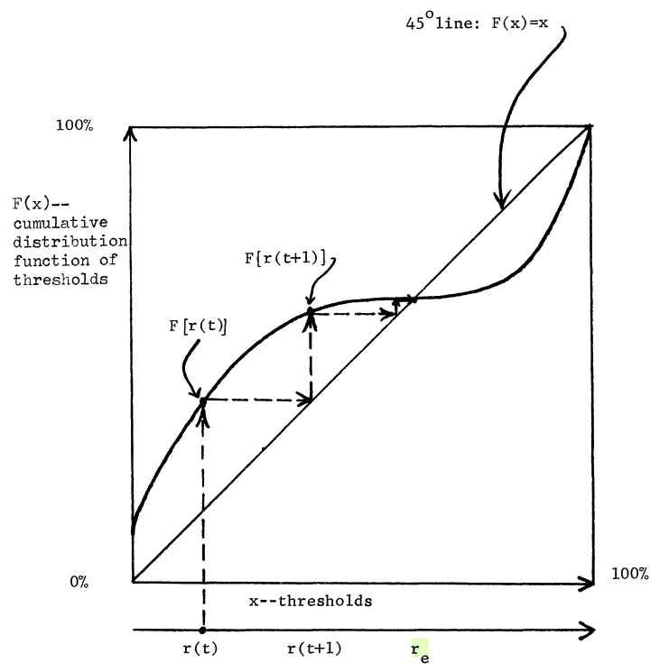
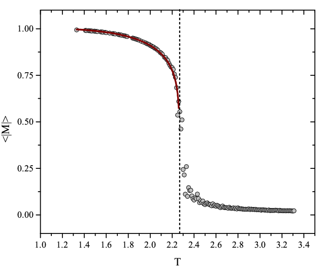
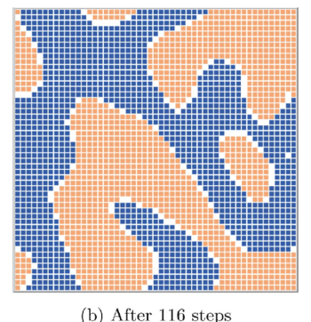

# Contagio social en redes

::: {.callout-tip icon="false"}
## Qué haremos

En la primera mitad de la clase vimos el contagio **simple**: una exposición basta, y los modelos SIR describen cómo se propaga. Este bloque parte de la pregunta que ese modelo no puede responder: **¿y si una exposición no basta?** Cuando adoptar cuesta —porque hay que coordinarse, porque no es creíble, porque puede ser mal visto, o porque se necesita el ánimo de otros— se necesitan **varias** fuentes que refuercen. Eso es un contagio **complejo**, y cambia todo lo que creíamos saber sobre qué estructuras difunden bien.

La frase-guía del bloque: *para un contagio simple, que la semilla vea lejos; para uno complejo, que la semilla vea acompañada.*
:::

| Sección | Contenido |
|---|---|
| 1. Umbrales | Granovetter (1978) → Valente (1996); y el umbral superior |
| 2. Contagio complejo | Centola & Macy (2007): puentes anchos vs. lazos largos |
| 3. Interludio 1 — Mecanismos | Influencias contrarias; fuentes vs. exposiciones; similitud vs. diversidad |
| 4. Interludio 2 — Transiciones de fase | De segundo y de primer orden |
| 5. Centralidad compleja | Guilbeault & Centola (2021), con su evidencia mixta |
| 6. Cómo ver contagio complejo | Firmas empíricas; la asimetría desinformación/corrección |
| 7. netdiffuseR | Simular, detectar, construir |

# Umbrales para la acción colectiva

## Granovetter (1978): decidir bajo interdependencia

El punto de partida de todo modelo de contagio social es una idea simple de Granovetter: muchas decisiones son **binarias** (actuar o no actuar) y su utilidad **depende de cuántos otros ya actuaron**. Unirse a una huelga, a una protesta, adoptar una tecnología, dejar una sala vacía en una fiesta: en todos estos casos, lo que me conviene cambia con lo que hacen los demás.

Cada individuo $i$ tiene un **umbral** $\tau_i$: la fracción mínima de adoptantes que necesita observar para actuar. La regla de decisión es

$$
a_i = 1 \iff r \geq \tau_i,
$$

donde $r$ es la proporción de la población que ya actuó. Lo notable es que la **distribución de umbrales** captura *toda* la dinámica. Si $F(x)$ es la función de distribución acumulada de los umbrales, la fracción de adoptantes evoluciona como

$$
r(t+1) = F\big(r(t)\big),
$$

y el equilibrio es un punto fijo, $r_e = F(r_e)$: el proceso se detiene donde la curva $F$ cruza la diagonal.

{width="55%" fig-align="center"}

### Agregación ≠ preferencias individuales

El ejemplo canónico. Hay 100 trabajadores con umbrales $0, 1, 2, \ldots, 99$: uno actúa sin necesitar a nadie, otro necesita ver a uno, otro a dos, y así. Iteramos: el de umbral 0 actúa; eso activa al de umbral 1; eso activa al de umbral 2… **los 100 terminan actuando**.

Ahora quitamos al trabajador de umbral 1 y lo reemplazamos por otro de umbral 2. El de umbral 0 actúa. Nadie tiene umbral 1. Los dos de umbral 2 necesitan ver a dos, y solo hay uno. **Se detiene en 1.**

Dos poblaciones con preferencias casi idénticas —difieren en una sola persona— producen resultados colectivos opuestos: 100 contra 1. Esta es la lección fundacional del bloque, y la razón de que ni encuestas ni promedios permitan predecir la acción colectiva: **el resultado no está en las preferencias, está en su distribución**.

::: callout-note
## Dos precisiones de Granovetter que se olvidan

- **El umbral no es una preferencia.** Es el punto donde la *utilidad neta* de actuar se vuelve positiva. Un utilitarista puro y alguien sensible al estatus pueden tener el mismo umbral por razones distintas: es "una medida conductual contingente, no una medida pura de preferencias normativas". (De hecho, el umbral se puede derivar formalmente de un juego de coordinación: Morris 2000; Easley & Kleinberg 2010, cap. 19.)
- **El modelo asume mezcla completa**: todos observan a todos por igual. No captura que importa *quiénes* actúan, no solo cuántos — y en la vida real uno no observa a la población, observa a sus vecinos.
:::

## Valente (1996): el umbral se vuelve de red

La segunda precisión es la que Valente resuelve: en vez de la proporción global $r$, cada persona mira su **propia red**. La **exposición** de $i$ es la fracción de sus contactos que ya adoptaron,

$$
E_i = \frac{\sum_{j} X_{ij}\, a_j}{\sum_{j} X_{ij}},
$$

y adopta cuando $E_i \geq \tau_i$. Es la misma idea de Granovetter, pero ahora la *estructura* de la red decide quién ve a quién — y con eso, el resultado colectivo pasa a depender de la topología. Todo lo que sigue en el bloque es una exploración de esa dependencia.

## El umbral superior: cuando demasiados también es un problema

Si el umbral es el punto donde la utilidad neta se vuelve positiva, nada impide que **demasiada** adopción la vuelva negativa de nuevo. Hay al menos tres mecanismos:

- **Saturación o congestión**: el valor cae con la multitud (el bar de El Farol de Arthur; una app que se vuelve lenta).
- **Pérdida de distinción**: lo que valía por exclusivo deja de valer cuando lo tiene todo el mundo — el *snob effect* de Leibenstein (1950); el *reverse bandwagon* de Granovetter & Soong (1986).
- **Señalización de identidad**: abandonar un rasgo cuando lo adoptan los "otros" (Berger & Heath 2007).

Alipour et al. (2024) formalizan esto como un **bi-umbral**: se adopta entre un umbral inferior y uno superior, y sobre el superior se **desadopta**. Con tres casos de Twitter muestran que este modelo predice el *declive* de las modas órdenes de magnitud mejor que el umbral lineal.

{width="45%" fig-align="center"}

Guarda esta idea: reaparece al final, porque `netdiffuseR` puede simular desadopción, y porque conecta con la pregunta de cuándo una cascada se revierte.

# Contagio complejo y la debilidad de los lazos largos

## Qué es un contagio complejo

Centola & Macy (2007) llaman **contagio complejo** a uno donde la transmisión no se logra con un solo contacto: se necesitan **varios** contactos que refuercen. Ejemplos: la credibilidad de una leyenda urbana, la adopción de una nueva tecnología, la disposición a participar en una manifestación riesgosa, la adopción de una moda de vanguardia.

¿Por qué una exposición no basta? Cuatro mecanismos, cada uno con su microfundamento:

| Mecanismo | La idea | Microfundamento (para seguir la pista) |
|---|---|---|
| **Complementariedad estratégica** | La innovación es costosa para los primeros y barata para los siguientes; se necesita masa crítica para que valga la pena. | Juegos de coordinación (Schelling 1978; Morris 2000); externalidades de red (Katz & Shapiro 1985). |
| **Credibilidad** | Una innovación no es creíble hasta que varios vecinos la adoptan (los médicos y la tetraciclina). | Cascadas informacionales (Bikhchandani, Hirshleifer & Welch 1992; Banerjee 1992): más adoptantes = más evidencia. |
| **Legitimidad** | Saber de un movimiento riesgoso no basta para unirse; ver a varios cercanos asistir, sí. | Normas sociales y sesgo de statu quo (Bicchieri 2006; Samuelson & Zeckhauser 1988). |
| **Contagio emocional** | Los impulsos expresivos se amplifican en reuniones concentradas social y espacialmente. | Efervescencia colectiva y cadenas de rituales de interacción (Collins 2004); contagio emocional (Hatfield et al. 1993). |

## La fortaleza de los lazos débiles… y su límite

Granovetter (1973) mostró que los lazos débiles —conocidos, no íntimos— tienden a conectar actores distantes, y por eso aceleran dramáticamente la difusión: de una enfermedad, de información laboral, de una tecnología. Su frase es célebre: *"lo que sea que se deba difundir puede llegar a un mayor número de personas y atravesar una mayor distancia social cuando se transmite a través de lazos débiles en lugar de fuertes."*

Centola y Macy están **en contra de esa frase**. No del hallazgo, sino de su generalización a "lo que sea que se deba difundir". La clave está en distinguir dos sentidos de "fortaleza":

- **Relacional**: un lazo fuerte conecta amigos cercanos con interacción frecuente.
- **Estructural**: un lazo es fuerte si facilita propagar algo a nodos distantes.

El descubrimiento de Granovetter es que los lazos débiles en sentido relacional son **fuertes en sentido estructural**: son atajos a través de la topología. Y los lazos fuertes relacionales son estructuralmente débiles porque son redundantes (transitividad: mis amigos ya se conocen).

Pero eso vale para contagio **simple**. Para uno complejo, un lazo largo puede ser débil en *ambos* sentidos: para el contagio simple lo que importa es el **largo** del puente; para el complejo, su **ancho** — cuántos lazos conectan a dos vecindarios. Y recablear lazos largos casi nunca crea puentes anchos.

## El modelo: un anillo con recableado

Definamos $a$ el número mínimo de vecinos adoptantes necesarios para contagiarse, $z$ el número de vecinos, y $\tau = a/z$ el umbral. Como Watts y Strogatz, suponemos umbral e influencia iguales para todos, y grados casi iguales. Los nodos empiezan en un anillo donde cada uno se conecta con sus $z$ vecinos más próximos, y luego recableamos una fracción $p$ de lazos al azar.

::: {layout="[33,33,33]"}


:::

Con más de un puente en juego el problema deja de ser tratable a mano, así que se simula: $z = 8$, umbrales $\tau = 1/8, 2/8, 3/8$, y se mide la **tasa de propagación** (iteraciones hasta que el contagio alcanza el 99% de la red) en función de $p$, desde la red regular ($p=0$) hasta la aleatoria ($p=1$), pasando por el mundo pequeño.

{width="60%" fig-align="center"}

::: {.callout-important}
## Resultados principales de Centola & Macy (2007)

1. **El contagio complejo no se beneficia de niveles bajos de aleatorización.** Con $\tau = 2/8$, la curva es plana hasta $p \approx 10^{-3}$.
2. **El efecto de $p$ sobre el tiempo de saturación no es monótono** para contagios complejos: baja, toca un mínimo y sube hasta que la propagación falla. Es un ejemplo de **transición de fase de primer orden** en la propagación (Interludio 2).
3. **La difusión de información no es equivalente a la difusión de comportamientos.** La frase de Granovetter es correcta para la primera y falsa para la segunda.
:::

Recuerda la figura de Watts–Strogatz del capítulo de mecanismos de formación: la misma perilla $p$ que allí hacía "pequeño" al mundo es la que aquí decide si un comportamiento se propaga. En la sección de `netdiffuseR` reproduciremos este resultado con diez líneas de código.

# Interludio 1 — Mecanismos: por qué varias fuentes

Antes de seguir con la estructura, conviene detenerse en el *por qué*. Tres ideas que la literatura reciente ha decantado, y que explican buena parte de lo que viene.

## Las influencias contrarias

En un contagio simple, los no-adoptantes son irrelevantes: si tengo contacto con alguien con sarampión, me contagio, sin importar cuántos sanos conozca. En un contagio complejo, los no-adoptantes **son una señal activa**: cada contacto que no adoptó dice, en silencio, "esto no es aceptado". Centola las llama *influencias contrarias* (*countervailing influences*). State & Adamic (2015) lo midieron en el cambio masivo de fotos de perfil en Facebook en apoyo al matrimonio igualitario: lo que predecía adoptar no era cuántos amigos ya lo habían hecho, sino **qué fracción** — el número de amigos que *no* lo habían hecho pesaba en contra.

La consecuencia es la primera sorpresa del bloque: **cuanto más conectado estás, más influencias contrarias enfrentas**. Un actor con cientos de contactos ve, ante cualquier innovación nueva, a cientos que todavía no la adoptan. Por eso los "influyentes" suelen ser *frenos* y no *aceleradores* de los contagios complejos, y por eso tantos movimientos —la Primavera Árabe en Egipto (Steinert-Threlkeld 2017), la adopción de Twitter (Toole et al. 2012), el *Ice Bucket Challenge* (Sprague & House 2017)— nacieron en la **periferia**, donde con pocos contactos basta poco refuerzo, y desde ahí crecieron hasta arrastrar al centro.

## Fuentes, no exposiciones

La segunda idea corrige una lectura ingenua del umbral: lo que cuenta no es cuántas *veces* recibo la señal, sino de cuántas **fuentes distintas e independientes** la recibo. La psicología social lo estableció hace décadas:

- **Asch (1955)**: con un cómplice que da la respuesta incorrecta, el 3% se conforma; con dos, el 13%; con tres, el 33%. Y después, **meseta**: más cómplices no agregan casi nada. Es un umbral con saturación, medido en laboratorio (Bond 2005 lo confirma en un meta-análisis de 125 estudios).
- **Latané (1981)**: la *ley psicosocial* del impacto social, $I = s\,N^{t}$ con $t < 1$ — cada fuente adicional agrega impacto, pero cada vez menos. Es la misma forma funcional de los retornos decrecientes del término `gwesp` que vimos en ERGM.
- **Harkins & Petty (1981, 1987)**, el *efecto de fuentes múltiples*: los mismos argumentos, presentados por varias personas, persuaden más que repetidos por una — porque provocan más **escrutinio**. Pero el efecto **desaparece** si se dice que las fuentes son miembros de un mismo comité que acordó una posición: solo cuentan las fuentes **independientes**. Y **Wilder (1977)** mostró lo mismo para la conformidad: dos personas de grupos distintos pesan más que dos del mismo grupo.
- **Morgan et al. (2012)**: el uso de información social crece con el número de demostradores *y* con su consenso.

La neurociencia muestra por qué esto pesa tanto: la señal social no se procesa como información neutra, sino como **valor** — cambiar de opinión ante el grupo se ve en el cerebro como un error de predicción del aprendizaje por refuerzo (Klucharev et al. 2009), y la opinión de los pares altera la codificación del valor de las cosas (Zaki et al. 2011; Zhang & Gläscher 2020).

Traducido a redes: no cuentes amigos adoptantes, cuenta **grupos distintos** de amigos adoptantes. Ugander et al. (2012) lo demostraron con el registro a Facebook: lo que predice unirse no es el número de contactos invitando, sino el número de **componentes conectados distintos** entre ellos — la *diversidad estructural*.

## Similitud o diversidad: depende de la barrera

La tercera idea afina la anterior. Si las fuentes independientes son lo que convence, ¿deben parecerse a mí o ser distintas entre sí? Centola (2022) responde que **depende de cuál barrera opera**: cuando la barrera es **credibilidad** o **emoción**, convencen los pares *similares* — la prueba social de mi propio grupo (Centola 2011: la homofilia aumenta la adopción de conductas de salud). Cuando la barrera es **legitimidad**, convencen las fuentes *diversas*: en el caso del signo igual, la gente cambió su foto cuando vio adoptantes de círculos sociales distintos — abuelos, colegas, amigos del colegio — porque eso probaba que el apoyo era amplio y el riesgo social, bajo. La misma estructura de refuerzo puede necesitar homofilia o heterofilia según *qué* se está difundiendo.

# Interludio 2 — Transiciones de fase de primer orden

Centola & Macy dicen que el colapso de la propagación al aumentar $p$ es "una transición de fase de primer orden". Vale la pena entender qué significa, porque el concepto reaparece en toda la ciencia de la complejidad social.

## Segundo orden: el cambio es continuo

El modelo de Ising con espines $s_i = \pm 1$ y **sin** campo externo ($B = 0$): al bajar la temperatura, la magnetización $m$ pasa de cero a distinta de cero de manera **continua** — la curva es empinada cerca de $T_c$ pero no salta.

{width="50%" fig-align="center"}

El modelo de **Schelling** de segregación se comporta parecido: la segregación emerge gradualmente al variar la tolerancia.

{width="35%" fig-align="center"}

## Primer orden: el cambio es un salto

Ahora Ising **con** campo externo $B$, manteniendo $T < T_c$. Al variar $B$, la magnetización **salta** de $-1$ a $+1$ de golpe — y no salta en el mismo punto al subir que al bajar: hay **histéresis**. Cerca del salto coexisten dos estados posibles (los dos signos de $m$), y cuál se observa depende de la historia.

{width="55%" fig-align="center"}

Tres marcas definen una transición de primer orden, y las tres importan para el contagio: (1) el **parámetro de orden salta** (no crece suavemente); (2) hay **histéresis**: revertir exige ir mucho más atrás que el punto donde se produjo el salto; (3) hay **coexistencia y metaestabilidad**: cerca del punto crítico el sistema puede quedar "atrapado" en un estado que no es el de equilibrio.

## Y en el contagio

Un contagio que requiere refuerzo se comporta como el segundo caso. La figura muestra el tamaño del brote según la probabilidad de transmisión en un modelo con refuerzo: para ciertos parámetros el brote crece de forma suave, pero para otros **salta** de casi nada a casi toda la población en un punto crítico.

{width="50%" fig-align="center"}

Es exactamente lo que Centola & Macy observan al aumentar $p$: la saturación pasa de "completa" a "ninguna" de golpe, no gradualmente. Y las tres marcas tienen lectura social directa: los *tipping points* de las normas (Centola et al. 2018 los provocaron experimentalmente con una minoría comprometida del 25%), la **irreversibilidad** de muchos cambios sociales (una vez que una norma cayó, restaurarla cuesta mucho más que lo que costó derribarla), y la **impredecibilidad** cerca del punto crítico, donde poblaciones casi idénticas producen resultados opuestos — que es, dicho en otro lenguaje, el ejemplo de los 100 trabajadores con que empezamos.

# Centralidad compleja: por qué la periferia importa

## El diagnóstico

Todas las centralidades que aprendimos —grado, intermediación, cercanía, autovector— comparten un supuesto escondido: que **un solo lazo constituye un paso** en la red. Es decir, están construidas sobre el *largo de camino simple*. Guilbeault & Centola (2021) muestran que ese supuesto las vuelve ciegas para los contagios complejos: para un comportamiento que necesita refuerzo, un lazo aislado *no es un camino*, y el nodo "central" según grado o intermediación puede estar, para ese contagio, en el peor lugar posible.

## La medida

La construcción es en tres pasos. El **ancho de un puente** entre dos vecindarios es cuántos lazos reforzantes los conectan. El **largo de camino complejo** entre $A$ y $B$ es cuántos puentes *suficientemente anchos* hay que atravesar para ir de uno a otro (puede ser mucho mayor que el largo simple: un lazo débil directo puede no contar). Y la **centralidad compleja** de un nodo es el promedio de sus largos de camino complejo hacia toda la red: a cuánta población alcanza vía cadenas de puentes anchos.

::: callout-warning
## Figura pendiente
Figura 1 de Guilbeault & Centola (2021): camino simple vs. camino complejo entre A y B. Guardar como `figs/contagio/11-guilbeault-centola-camino-complejo.png` y reemplazar este recuadro por la imagen.
:::

Un detalle que conviene decir en voz alta. Revisando el [código publicado](https://github.com/drguilbe/complexpaths), la centralidad compleja se **calcula simulando**: para cada nodo, se activa su vecindario y se corre una cascada de umbral determinista; el largo de camino complejo se mide sobre lo que se activó. Es una centralidad *definida por un proceso* —como PageRank lo está por un paseo aleatorio—, lo que es legítimo, pero implica dos cosas: requiere **asumir un umbral** $T$, y su validación en simulación (elegir semillas con la medida y evaluarlas con el mismo modelo de umbral) es casi circular. La prueba no circular es la empírica.

## Qué encuentran

En 74 redes escolares (Add Health), las semillas elegidas por centralidad compleja superan a las elegidas por grado, intermediación, autovector, k-core y percolación, para todo umbral. Y en las 43 aldeas indias del programa de microfinanzas de Banerjee et al. (2013), las aldeas con mayor largo de camino complejo promedio difundieron más, y los hogares con alta centralidad compleja —no los "líderes" que los investigadores habían preseleccionado— predicen mejor que sus vecinos adopten.

Su afirmación textual es cuidadosa: *"network locations with low degree centrality and low betweenness centrality **may** nevertheless be the most influential locations in the population."* El *may* importa: no es que la periferia gane por ser periferia; gana **cuando está embebida en un vecindario denso con puentes anchos**.

## La evidencia empírica es mixta

Las simulaciones establecen el patrón; los datos lo matizan.

| A favor de "los hubs dispersos fallan" | Matices |
|---|---|
| **Kim et al. (2015, *Lancet*)** — RCT en 32 aldeas: sembrar en los de mayor *in-degree* **no superó al azar**. | **Banerjee et al. (2013)** — su centralidad de difusión (camino simple) **sí** predijo la adopción: la *información* viaja simple aunque adoptar sea complejo. |
| **Beaman et al. (2021, *AER*)** — RCT en 200 aldeas: la adopción requiere ≥ 2 contactos informados; la siembra por teoría de redes supera al extensionista. | **Valente & Vega Yon (2020)** — con *distribuciones* de umbral (media 0.33 y varianza), las semillas de alto in-degree son las más rápidas y las **marginales las peores**. |
| **Centola (2010, *Science*)** — las redes clusterizadas difunden más un comportamiento de salud que las aleatorias. | **Iyengar, Van den Bulte & Valente (2011)** — los líderes de opinión sí aceleran la adopción de un fármaco. |
| **Ugander et al. (2012)**; **Romero et al. (2011)**; **Mønsted et al. (2017)** — diversidad estructural, persistencia y experimentos con bots. | **Watts (2002)** — en el régimen de baja conectividad los hubs *sí* disparan cascadas. |
| **Barberá et al. (2015)**; **Steinert-Threlkeld (2017)** — la periferia genera el alcance de las protestas. | **Airoldi & Christakis (2024)** — semillas de *mayor* grado (nominadas por amigos) funcionan: pero están embebidas en clusters. |

::: {.callout-important}
## Lo que sí está firme
Lo que fracasa no es "el hub", sino la **siembra dispersa**: un nodo aislado cuyos vecinos solo lo ven a él. Lo que funciona es la **siembra reforzada** —semillas adyacentes que se dan refuerzo mutuo—, esté en la periferia (donde es barata) o en el centro. *Para contagio simple, que la semilla vea lejos; para contagio complejo, que la semilla vea acompañada.*
:::

# Cómo ver contagio complejo en la literatura

¿Cómo saber, con datos, si algo se propaga como contagio complejo? Cinco firmas que la literatura ha usado, cada una con su estudio de referencia:

1. **Persistencia.** Romero, Meeder & Kleinberg (2011): en Twitter, los hashtags *políticos* y los controversiales necesitan más exposiciones repetidas para ser adoptados que los idiomáticos o de entretenimiento — la curva de adopción según número de exposiciones tiene distinta forma según el tema.
2. **Experimento con fuentes.** Mønsted et al. (2017): con bots en Twitter que controlan cuántas fuentes distintas exponen a cada persona, la probabilidad de adoptar crece con el número de fuentes de manera consistente con contagio complejo, no simple.
3. **Umbral en campo.** Beaman et al. (2021): en Malawi, los agricultores adoptan una tecnología cuando al menos **dos** contactos la conocen; con uno, casi nadie.
4. **Diversidad estructural.** Ugander et al. (2012): lo que predice unirse a Facebook es el número de *componentes* distintos entre quienes te invitan.
5. **Puentes anchos históricos.** Saetre (2025, *AJS*): *Un violador en tu camino* saltó de Valparaíso a 60 países en semanas. La diáspora chilena formada en los 70 funcionó como **puente ancho latente**: clusters de personas con lazos simultáneos a Chile y a sus sociedades de acogida, que primero replicaron la performance en solidaridad y luego permitieron que locales no chilenos la adaptaran. La autora mide el ancho del puente con el tamaño de la diáspora por ciudad *y* sus lazos vigentes con Chile, y muestra la secuencia diáspora → adaptación local → prescindir del intermediario.

::: callout-warning
## Figura pendiente
Mapa o secuencia temporal de la difusión de *Un violador en tu camino* (Saetre 2025). Guardar como `figs/contagio/12-saetre-un-violador-difusion.png` y reemplazar este recuadro.
:::

## La asimetría: lo que confirma es simple, lo que desafía es complejo

Una consecuencia de todo lo anterior, que Centola (2022) desarrolla y que vale un párrafo propio: **las redes no son tuberías, son prismas**. La información que *confirma* los sesgos de una comunidad es fácil de entender y de aceptar — se propaga como contagio **simple**, y los nodos muy conectados la difunden sin fricción. La información que *desafía* esos sesgos encuentra resistencia — es un contagio **complejo**, y necesita refuerzo de fuentes que la comunidad considere relevantes. De ahí la asimetría estructural entre desinformación y corrección: la corrección siempre corre con desventaja de mecanismo, no solo de contenido. Las mascarillas en la pandemia son el ejemplo de Centola: la misma conducta fue contagio simple en comunidades que confiaban en la autoridad sanitaria y contagio complejo donde no.

## El *backfire*: cuando la estrategia del contagio simple mata al complejo

Google+ (2011–2019) es el caso de manual. Google usó su alcance para asociar a cientos de millones de cuentas con Google+ en una campaña masiva de *awareness*. Logró que todo el mundo supiera que existía — y que todo el mundo supiera que **nadie lo usaba**. Esa visibilidad convirtió a cada usuario de Facebook en una influencia contraria explícita: prueba social *en contra*. Centola lo llama la *falacia del fregadero* (*kitchen sink fallacy*): aplicar agresivamente estrategias de contagio simple (alcance, difusión masiva) a un contagio complejo (una red social, que requiere coordinación) no es inocuo — puede impedir la adopción.

# netdiffuseR: simular, detectar, construir

`netdiffuseR` es el paquete de R para difusión en redes (Valente, Vega Yon y colaboradores). Tiene mucho más de lo que veremos; aquí, tres capacidades que bastan para empezar a investigar.

## Simular: las mismas semillas, juntas o separadas

Reproduzcamos la intuición de Centola & Macy en diez líneas. Un anillo de 300 nodos con 8 vecinos cada uno y 2% de recableado; umbral $\tau = 2/8$ (contagio complejo: hacen falta dos vecinos adoptantes); y **las mismas 8 semillas**, en dos versiones: contiguas, o separadas por 40 posiciones (ninguna adyacente a otra).

```{r}
#| label: nd-simular
#| message: false
#| warning: false
library(netdiffuseR)

set.seed(21)
n <- 300
A <- as.matrix(rgraph_ws(n, 8, p = 0.02, undirected = TRUE))
A <- 1 * ((A + t(A)) > 0)                       # simétrica y binaria

juntas    <- 1:8                                # bloque contiguo
dispersas <- seq(20, 300, by = 40)[1:8]         # separadas: ninguna es vecina de otra

simular <- function(semillas) {
  rdiffnet(seed.graph = A, t = 200, seed.nodes = semillas,
           threshold.dist = 0.25,                 # 2 de 8 vecinos
           exposure.args = list(normalized = TRUE),
           rewire = FALSE, stop.no.diff = FALSE)
}
d_juntas    <- simular(juntas)
d_dispersas <- simular(dispersas)

c(juntas = mean(!is.na(d_juntas$toa)), dispersas = mean(!is.na(d_dispersas$toa)))
```

```{r}
#| label: fig-nd-simular
#| fig-cap: "Fracción acumulada de adoptantes. Las semillas contiguas recorren toda la red con un frente lineal; las mismas ocho semillas, separadas, no contagian a nadie."
#| fig-height: 4
#| warning: false
curva <- function(d) cumulative_adopt_count(d)[1, ] / n
plot(curva(d_juntas), type = "l", lwd = 3, col = "#d73027", ylim = c(0, 1),
     xlab = "Período", ylab = "Fracción de adoptantes")
lines(curva(d_dispersas), lwd = 3, col = "#4575b4")
legend("right", c("8 semillas juntas", "8 semillas separadas"),
       col = c("#d73027", "#4575b4"), lwd = 3, bty = "n")
```

Mismas semillas, misma red, mismo umbral: **juntas encienden toda la red; separadas, ninguna prende a nadie**. Ese es el puente ancho en acción — y por qué "sembrar en clusters" es la única recomendación firme de toda la literatura de centralidad compleja.

::: {.callout-note}
## Para jugar
1. Cambia `threshold.dist` a `1/8`: ahora es contagio simple. ¿Importa que las semillas estén juntas?
2. Sube el recableado `p` a 0.1 y 0.3 con $\tau = 2/8$. ¿Qué pasa con la prevalencia final? Estás recorriendo la curva de Centola & Macy.
3. `rdiffnet` tiene un argumento `disadopt`: con él puedes implementar el **bi-umbral** (adoptar entre dos umbrales, abandonar sobre el superior). ¿Cómo cambia la curva?
:::

## Detectar: ¿hay firma de contagio complejo en datos reales?

`netdiffuseR` trae los tres datasets clásicos de difusión de innovaciones: los médicos y la tetraciclina (Coleman, Katz & Menzel 1966), los agricultores brasileños y el maíz híbrido, y las mujeres coreanas y la planificación familiar. Usemos el primero. La pregunta: ¿adoptar depende de **cuántos** vecinos ya adoptaron, y de forma *creciente* con el segundo y tercer vecino (firma compleja), o basta con uno (firma simple)?

```{r}
#| label: nd-detectar-umbrales
#| fig-cap: "Umbral observado de cada médico (fracción de sus contactos que ya habían adoptado cuando él adoptó) según su tiempo de adopción."
#| fig-height: 4.5
#| message: false
#| warning: false
data(medInnovationsDiffNet)
dn <- medInnovationsDiffNet
dn
plot_threshold(dn)
```

Muchos adoptaron con exposición cero (los innovadores) y muchos con exposición completa (los rezagados). Para testear la firma, armamos la tabla nodo-período de quienes aún *no* han adoptado, y modelamos la adopción según la **exposición en conteo** del período anterior, primero lineal y luego por escalones:

```{r}
#| label: nd-detectar-modelo
#| message: false
#| warning: false
expo_n <- cbind(NA, exposure(dn, normalized = FALSE)[, -nslices(dn)])  # vecinos adoptantes en t-1
dn[["expo_n"]] <- expo_n

largo <- as.data.frame(dn)                                # una fila por nodo-período
largo$adopta <- as.integer(!is.na(largo$toa) & largo$toa == largo$per)
riesgo <- largo[(is.na(largo$toa) | largo$per <= largo$toa) & !is.na(largo$expo_n), ]

m_lineal <- glm(adopta ~ expo_n + factor(per), data = riesgo, family = binomial)
m_escalon <- glm(adopta ~ I(expo_n >= 1) + I(expo_n >= 2) + I(expo_n >= 3) + factor(per),
                 data = riesgo, family = binomial)

round(coef(summary(m_lineal))[2, , drop = FALSE], 3)
round(coef(summary(m_escalon))[2:4, ], 3)
c(AIC_lineal = AIC(m_lineal), AIC_escalon = AIC(m_escalon))
```

El veredicto honesto: **no hay firma clara de contagio complejo** en estos datos. Ni el efecto lineal es significativo, ni los escalones muestran el salto creciente al segundo o tercer vecino, ni el modelo escalonado mejora el AIC. Es coherente con lo que se sabe de este caso desde Van den Bulte & Lilien (2001): la adopción de la tetraciclina estuvo dominada por el *marketing* farmacéutico, y el "contagio" original de Coleman se desvanece al controlarlo. Un test de dependencia estructural dice lo mismo — el umbral medio observado no difiere del que darían redes con la misma secuencia de grados:

```{r}
#| label: nd-detectar-struct
#| message: false
#| warning: false
set.seed(1)
struct_test(dn, function(x) mean(threshold(x), na.rm = TRUE), R = 200)
```

Que un detector diga *no* es tan informativo como que diga *sí*: la mayoría de las difusiones célebres no son contagios complejos, y saber distinguirlas es exactamente la competencia que este bloque quiere dejar instalada.

::: {.callout-note}
## Para jugar
Repite el análisis con `brfarmersDiffNet` (agricultores) y `kfamilyDiffNet` (planificación familiar). ¿En cuál aparece el salto al segundo vecino?
:::

## Construir: de la encuesta al `diffnet`

Todo lo anterior necesita un objeto `diffnet`: la red más los tiempos de adopción. Si tus datos vienen de una encuesta con generador de nombres —como la de nuestra primera ayudantía— la función `survey_to_diffnet()` lo arma directamente. Con la encuesta cruda coreana que trae el paquete:

```{r}
#| label: nd-construir
#| message: false
#| warning: false
data(kfamily)
kf <- survey_to_diffnet(
  dat      = kfamily,
  idvar    = "id",                                       # identificador de cada ego
  netvars  = c(paste0("net1", 1:5), paste0("net2", 1:5), paste0("net3", 1:5)),  # las nominaciones
  toavar   = "toa",                                      # tiempo de adopción
  groupvar = "village"                                   # las redes son por aldea
)
kf
```

Tres columnas mínimas: un **id**, las **nominaciones** y el **tiempo de adopción**. Nuestra `encuesta_nominaciones.xlsx` tiene las dos primeras; agrégale una columna `toa` (¿cuándo adoptó cada persona la conducta que te interesa?) y ya puedes correr sobre ella todo lo de esta sección: umbrales observados, exposición, el test de firma y las simulaciones.
