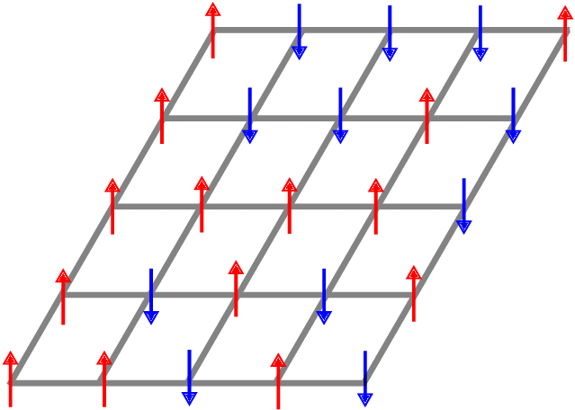
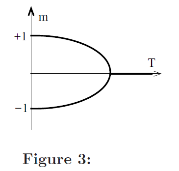
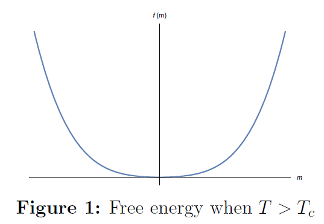
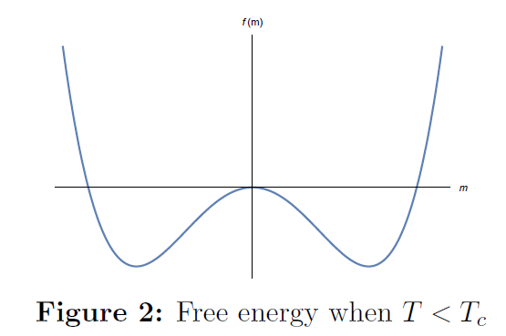
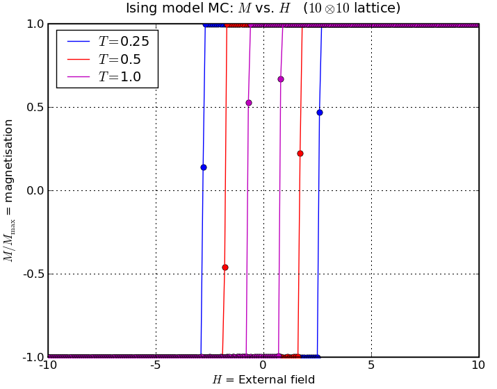

# Anexos {.unnumbered}

Material que complementa los capítulos pero que no cabe en una sesión. Se lee por separado y se cita desde el capítulo correspondiente.

# Transiciones de fase: de la física al contagio

Centola & Macy (2007) dicen que el colapso de la propagación al aumentar el recableado es "una transición de fase de primer orden". La frase viene de la física, y vale la pena entender qué significa allá antes de usarla acá, porque el concepto reaparece en toda la ciencia de la complejidad social: *tipping points*, irreversibilidad de las normas, impredecibilidad cerca del punto crítico.

## El modelo de Ising: una red de espines

El sistema más simple que tiene una transición de fase es el **modelo de Ising**. Imaginemos una red regular (una grilla) donde cada nodo $i$ tiene un **espín** $s_i$ que solo puede apuntar hacia arriba ($+1$) o hacia abajo ($-1$). Cada espín quiere alinearse con sus vecinos: la energía baja cuando dos vecinos apuntan igual y sube cuando apuntan distinto. Y hay un **campo externo** $B$ que empuja a todos los espines hacia una dirección.

{width="45%" fig-align="center"}

La energía total es

$$
E = -J \sum_{\langle i,j \rangle} s_i s_j \;-\; B \sum_i s_i ,
$$

donde la primera suma recorre los pares de vecinos y $J > 0$ es la fuerza de la interacción. El sistema está a una **temperatura** $T$ que introduce ruido: a $T$ alta, los espines saltan al azar sin importar la energía; a $T$ baja, se acomodan en la configuración de menor energía.

La variable que resume el estado del sistema es la **magnetización** $m$: la fracción neta de espines que apuntan hacia arriba,

$$
m = \frac{1}{N} \sum_i s_i \in [-1, 1].
$$

Si $m = 0$, hay tantos arriba como abajo (desorden). Si $m = \pm 1$, están todos alineados (orden). $m$ es lo que en física se llama **parámetro de orden**, y la traducción a redes sociales es inmediata: la fracción de adoptantes de una conducta.

::: callout-note
## Por qué esto es un modelo social

Un espín que quiere alinearse con sus vecinos **es** un agente que quiere adoptar lo que adoptan sus vecinos. El campo externo es la utilidad intrínseca de la conducta (o la campaña de marketing, o la autoridad sanitaria). La temperatura es el ruido idiosincrático de las decisiones. Y la magnetización es la prevalencia. Con esa traducción, todo lo que sigue se lee dos veces.
:::

## Segundo orden: el cambio es continuo

Empecemos **sin** campo externo ($B = 0$) y variemos la temperatura. La herramienta para ver qué pasa es la **energía libre** $f(m)$: una función que dice cuán "cómodo" está el sistema en cada valor de $m$. El sistema se queda en el mínimo de $f$.

::: {layout="[50,50]"}

:::

Al cruzar la **temperatura crítica** $T_c$, el mínimo único se bifurca en dos. Pero los dos mínimos nuevos nacen *en* $m = 0$ y se separan gradualmente: la magnetización crece de forma **continua** desde cero. Eso es una transición de **segundo orden**: el parámetro de orden no salta.

::: {layout="[45,55]"}

:::

## Primer orden: el cambio es un salto

Ahora mantengamos $T < T_c$ (ya hay dos mínimos) y encendamos el campo $B$. El campo **inclina** la energía libre: favorece un mínimo y perjudica el otro.

{width="85%" fig-align="center"}

Aquí está la clave. Si el sistema está en el mínimo de la izquierda ($m < 0$) y empezamos a subir $B$, el mínimo se vuelve cada vez menos profundo, pero el sistema **se queda ahí**: para saltar al otro lado necesita superar la barrera del medio. Solo cuando la barrera desaparece por completo, el sistema cae de golpe al otro mínimo. La magnetización pasa de $-1$ a $+1$ **de un salto**.

{width="55%" fig-align="center"}

Y si ahora bajamos $B$ de vuelta, el salto **no ocurre en el mismo punto**: el sistema está atrapado en $m > 0$ hasta que la barrera desaparece por el otro lado. Eso es la **histéresis**: el estado depende de la historia, no solo de los parámetros actuales.

{width="70%" fig-align="center"}

Tres marcas definen una transición de primer orden:

1. **El parámetro de orden salta**, no crece suavemente.
2. **Hay histéresis**: revertir exige ir mucho más atrás que el punto donde se produjo el salto.
3. **Hay coexistencia y metaestabilidad**: cerca del punto crítico, dos estados son posibles, y el sistema puede quedar "atrapado" en el que no es el de menor energía.

## En las ciencias sociales

Ahora la lectura social de cada figura.

### Segundo orden: Schelling

El modelo de **Schelling** de segregación se comporta como el Ising sin campo. Cada agente tiene una tolerancia mínima a vecinos distintos; al variarla, la segregación emerge **gradualmente**. No hay un salto: hay una curva empinada pero continua, igual que la magnetización al bajar la temperatura.

{width="35%" fig-align="center"}

### Primer orden: el contagio complejo

Un contagio que requiere refuerzo se comporta como el Ising **con** campo bajo $T_c$. La figura muestra el tamaño del brote según la probabilidad de transmisión en un modelo con refuerzo: para ciertos parámetros el brote crece de forma suave, pero para otros **salta** de casi nada a casi toda la población en un punto crítico.

{width="50%" fig-align="center"}

Es exactamente lo que Centola & Macy observan al aumentar $p$: la saturación pasa de "completa" a "ninguna" de golpe, no gradualmente. Y las tres marcas tienen lectura social directa:

- **El salto** son los *tipping points* de las normas: Centola et al. (2018) los provocaron experimentalmente con una minoría comprometida del 25%.
- **La histéresis** es la irreversibilidad de muchos cambios sociales: una vez que una norma cayó, restaurarla cuesta mucho más que lo que costó derribarla.
- **La coexistencia** es la impredecibilidad cerca del punto crítico, donde poblaciones casi idénticas producen resultados opuestos. Dicho en otro lenguaje, es el ejemplo de los 100 trabajadores de Granovetter con que empieza el capítulo de contagio.

::: callout-tip
## La regla para distinguirlas en datos

Si al variar un parámetro (recableado, umbral, tamaño de la semilla) la prevalencia final cambia **suavemente**, la transición es de segundo orden y el sistema es predecible. Si **salta**, y además el salto ocurre en puntos distintos según se suba o se baje el parámetro, es de primer orden: hay que preguntarse de dónde viene el sistema, no solo dónde está.
:::
